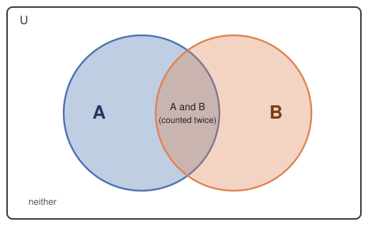

# Lesson 2: The Inclusion–Exclusion Principle (Two and Three Sets)

The addition principle from [01-sum-and-product-rules.md](./01-sum-and-product-rules.md) only works when the "or" cases are mutually exclusive. When they can overlap, plain addition double-counts the overlap. This lesson fixes that with two concrete patterns: overlapping **two** sets, and overlapping **three** sets. These two cases cover the vast majority of AMC-level problems, so we stop there rather than building a general $n$-set formula.

## 1. Why Plain Addition Fails When Cases Overlap

Picture two overlapping groups as a Venn diagram:

If you add $|A| + |B|$, everything in the middle "A and B" region gets counted twice — once as part of $A$, once as part of $B$. To get the true count of "in A or B," you need to subtract that middle region back out once.

## 2. The Two-Set Case

$$|A \text{ or } B| = |A| + |B| - |A \text{ and } B|$$

Read it as: add both groups, then remove the part you counted twice.

### Reading Example: Divisible by 3 or by 4

How many integers from 1 to 100 are divisible by 3 or by 4?

- Multiples of 3 up to 100: $\lfloor 100 / 3 \rfloor = 33$
- Multiples of 4 up to 100: $\lfloor 100 / 4 \rfloor = 25$
- Multiples of both 3 and 4, i.e. multiples of $\text{lcm}(3, 4) = 12$: $\lfloor 100 / 12 \rfloor = 8$

$$33 + 25 - 8 = 50$$

### Reading Example: Even or a Multiple of 5

How many 2-digit numbers (10 to 99) are even **or** a multiple of 5?

- Even 2-digit numbers: last digit in $\{0, 2, 4, 6, 8\}$ (5 ways), first digit in $\{1, \ldots, 9\}$ (9 ways) → $9 \times 5 = 45$.
- 2-digit multiples of 5: last digit in $\{0, 5\}$ (2 ways), first digit 9 ways → $9 \times 2 = 18$.
- Numbers that are both even and a multiple of 5 are multiples of 10: last digit $0$ only, 9 ways for the first digit → $9$.

$$45 + 18 - 9 = 54$$

**Non-obvious detail:** the "and" count (the overlap) is almost always found the same way as the individual counts — here, by finding the multiples of the least common multiple of the two divisors. This is what makes the subtraction term easy to compute in practice.

## 3. The Three-Set Case

With three overlapping sets, subtracting all three pairwise overlaps removes the very middle region (where all three sets meet) **three times** — once for each pair — even though it only ever got added in **three times** by the individual counts too. Net effect: the triple-overlap region has been completely erased and needs to be added back once.

$$
|A \text{ or } B \text{ or } C| = |A| + |B| + |C|
                - |A \text{ and } B| - |B \text{ and } C| - |C \text{ and } A|
                + |A \text{ and } B \text{ and } C|
$$

### Reading Example: Divisible by 2, 3, or 5

How many integers from 1 to 100 are divisible by 2, 3, or 5?

Single counts:

$$
\begin{aligned}
\text{div by } 2:\ & \lfloor 100/2 \rfloor = 50 \\
\text{div by } 3:\ & \lfloor 100/3 \rfloor = 33 \\
\text{div by } 5:\ & \lfloor 100/5 \rfloor = 20
\end{aligned}
$$

Pairwise overlaps (divisible by the $\text{lcm}$ of each pair):

$$
\begin{aligned}
\text{div by } 2 \text{ and } 3\ (\text{lcm } 6):\ & \lfloor 100/6 \rfloor = 16 \\
\text{div by } 3 \text{ and } 5\ (\text{lcm } 15):\ & \lfloor 100/15 \rfloor = 6 \\
\text{div by } 5 \text{ and } 2\ (\text{lcm } 10):\ & \lfloor 100/10 \rfloor = 10
\end{aligned}
$$

Triple overlap (divisible by $\text{lcm}(2, 3, 5) = 30$):

$$\text{div by } 2, 3, \text{ and } 5:\ \lfloor 100/30 \rfloor = 3$$

Combine:

$$(50 + 33 + 20) - (16 + 6 + 10) + 3 = 103 - 32 + 3 = 74$$

## 4. Class Practice 1: Two-Set Overlap

### Problem

How many integers from 1 to 60 are divisible by 4 or by 6?

### Answer Choices

(A) 15  (B) 20  (C) 25  (D) 30  (E) 35

### Solution

$$
\begin{aligned}
\text{div by } 4:\ & \lfloor 60/4 \rfloor = 15 \\
\text{div by } 6:\ & \lfloor 60/6 \rfloor = 10 \\
\text{div by } \text{lcm}(4, 6) = 12:\ & \lfloor 60/12 \rfloor = 5
\end{aligned}
$$

$$15 + 10 - 5 = 20$$

The answer is **(B) 20**.

## 5. Class Practice 2: Three-Set Overlap with Groups of People

### Problem

In a class of 40 students, 18 play soccer, 15 play basketball, and 10 play tennis. 7 play both soccer and basketball, 4 play both basketball and tennis, and 5 play both soccer and tennis. 2 students play all three sports. How many students play at least one of the three sports?

### Answer Choices

(A) 24  (B) 27  (C) 29  (D) 33  (E) 36

### Solution

$$(18 + 15 + 10) - (7 + 4 + 5) + 2 = 43 - 16 + 2 = 29$$

The answer is **(C) 29**.

## 6. Class Practice 3: Three-Set Overlap, Numeric

### Problem

How many integers from 1 to 60 are divisible by 2, 3, or 5?

### Answer Choices

(A) 38  (B) 40  (C) 42  (D) 44  (E) 46

### Solution

Single counts:

$$
\begin{aligned}
\text{div by } 2:\ & \lfloor 60/2 \rfloor = 30 \\
\text{div by } 3:\ & \lfloor 60/3 \rfloor = 20 \\
\text{div by } 5:\ & \lfloor 60/5 \rfloor = 12
\end{aligned}
$$

Pairwise overlaps:

$$
\begin{aligned}
\text{div by } 6:\ & \lfloor 60/6 \rfloor = 10 \\
\text{div by } 15:\ & \lfloor 60/15 \rfloor = 4 \\
\text{div by } 10:\ & \lfloor 60/10 \rfloor = 6
\end{aligned}
$$

Triple overlap:

$$\text{div by } 30:\ \lfloor 60/30 \rfloor = 2$$

Combine:

$$(30 + 20 + 12) - (10 + 4 + 6) + 2 = 62 - 20 + 2 = 44$$

The answer is **(D) 44**.

## 7. Common Mistakes

### 7.1 Forgetting the triple-overlap add-back in the three-set case

Stopping after subtracting the three pairwise overlaps leaves the innermost region erased instead of counted once — always add $|A \text{ and } B \text{ and } C|$ back at the end.

### 7.2 Computing an overlap count the wrong way

For "divisible by" problems, the overlap of two divisibility conditions is divisibility by their **least common multiple**, not their product — e.g., the overlap of "divisible by 4" and "divisible by 6" is "divisible by 12" ($\text{lcm}(4, 6)$), not "divisible by 24."

### 7.3 Reaching for three-set inclusion–exclusion when two-set is enough

If a problem only has two overlapping conditions, use the simpler two-set formula — adding an unnecessary third "set" of size 0 just invites arithmetic mistakes.

## 8. Key Takeaways

- Two sets: $|A \text{ or } B| = |A| + |B| - |A \text{ and } B|$.
- Three sets: $|A \text{ or } B \text{ or } C| = |A| + |B| + |C| - |A \text{ and } B| - |B \text{ and } C| - |C \text{ and } A| + |A \text{ and } B \text{ and } C|$.
- For "divisible by" problems, an overlap count is divisibility by the least common multiple of the individual divisors.
- These two patterns (two-set, three-set) cover essentially all AMC-level overlap problems — a general $n$-set formula is rarely worth the added complexity.

Next lesson: [03-permutations-and-combinations.md](./03-permutations-and-combinations.md) moves from counting cases to counting ordered and unordered arrangements.
