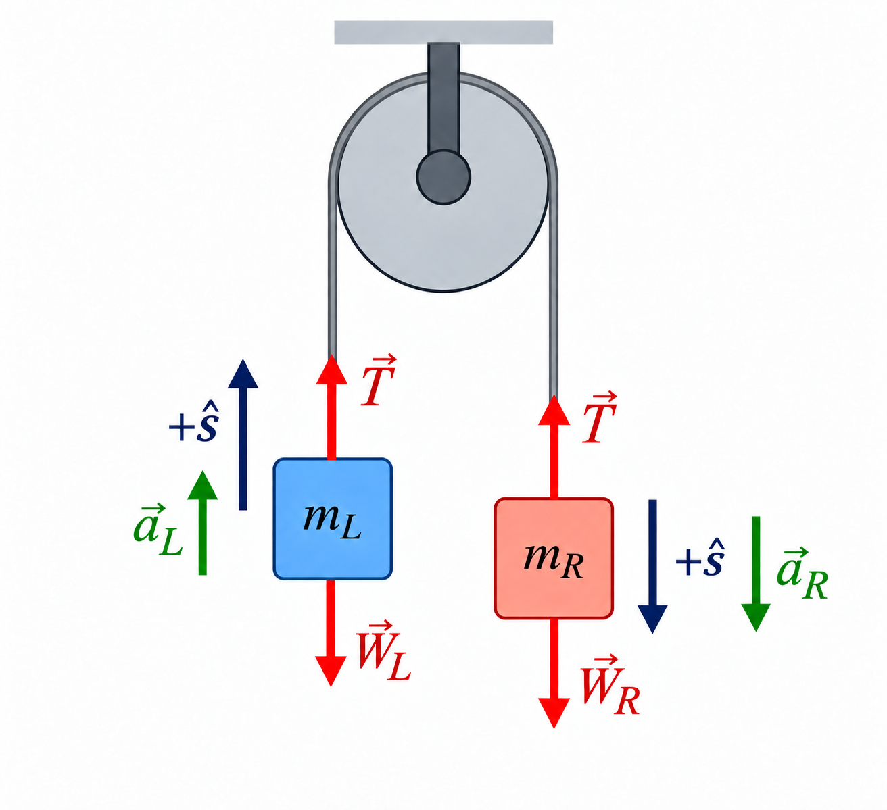
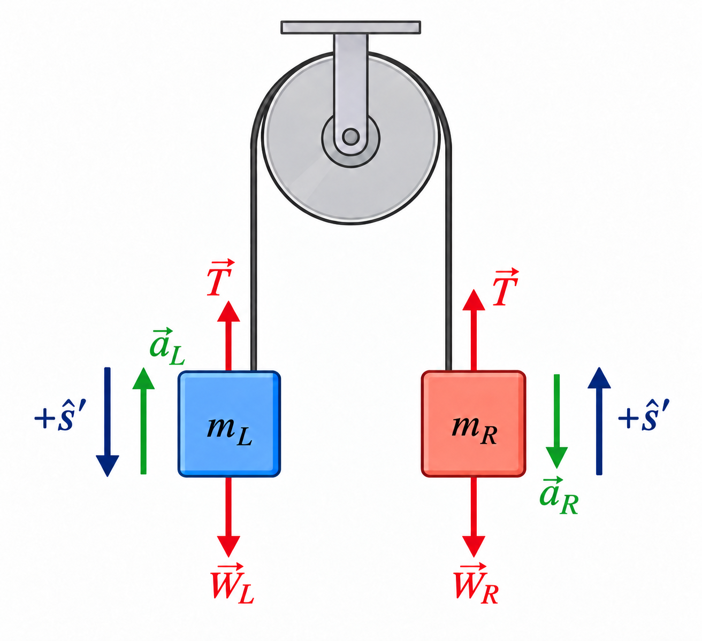
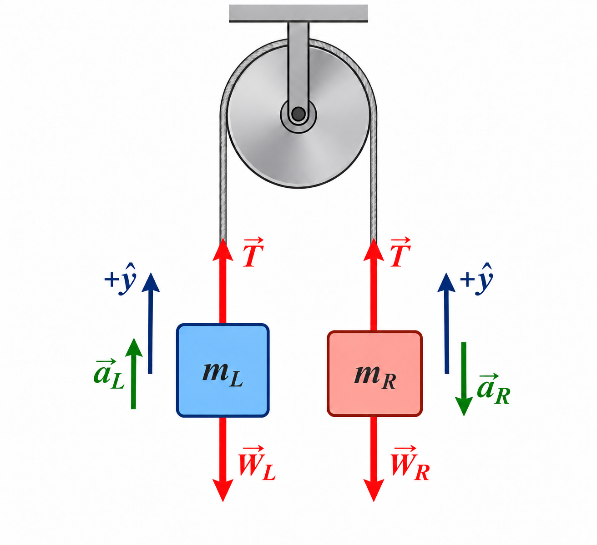
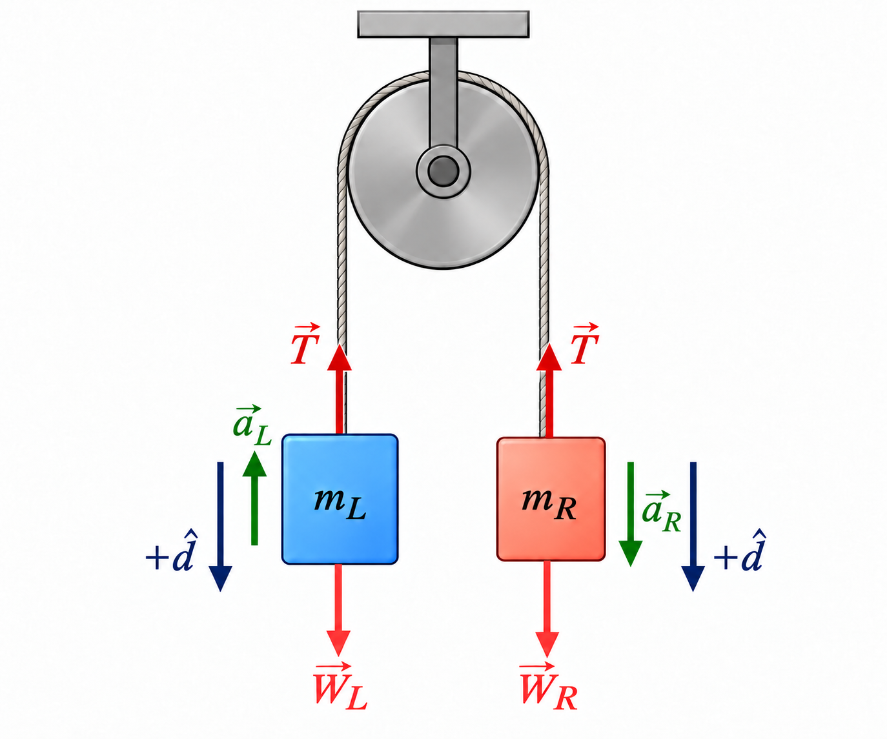
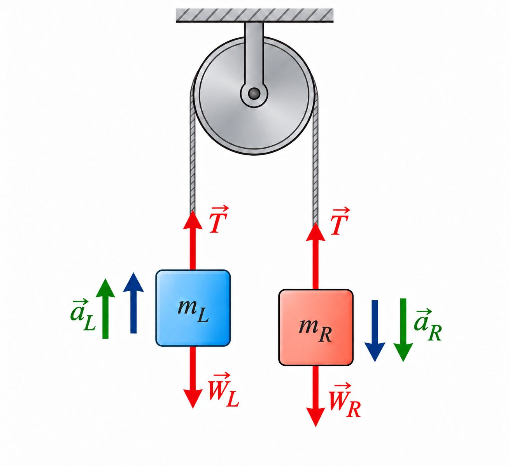

# Positive Direction, Symbol Meaning, and Newton's Second Law
*AP Physics / Misc*

> **Core rule: define the direction first, then give every symbol one meaning.**
>
> Students are rarely confused by a minus sign itself. The real problem is that the same bare letter is sometimes used for a component along a chosen direction and sometimes, without warning, for a magnitude. This note separates those meanings completely.

## 1. A usable standard

For a one-dimensional force problem, or a problem constrained to one direction, write in this order.

1. **Write a unit vector for the positive direction.** For example, $\hat y$ can mean vertically upward, and $\hat s$ can mean a specified positive direction along a rope. This rigorously defines “positive.”
2. **Default rule: a bare scalar for a directional quantity is that vector's component in the positive direction.**

   $$
   a=\vec a\cdot\hat s,\qquad F=\vec F\cdot\hat s.
   $$

   Therefore, in a one-dimensional problem,

   $$
   \vec a=a\hat s,\qquad \vec F=F\hat s.
   $$

   Thus $a$, $F$, and $T_s$ may be negative. A negative sign is information, not an error.
3. **Magnitude override rule: if a symbol represents a vector's magnitude, write absolute-value bars.**

   $$
   |\vec T|,\quad |\vec a|,\quad |\vec F|.
   $$

   For example, $|\vec T|$ is never negative, while $T_s=\vec T\cdot\hat s$ may be positive, zero, or negative. Do not let an unexplained $T$ play both roles on the same page.
4. **Write Newton's second law as a vector equation first.**

   $$
   \boxed{\sum\vec F=m\vec a}
   $$

   If only one direction is needed, dot both sides with the unit vector. The signs arise from the dot product; they are not something to memorize by force direction.

Quantities such as mass $m$, the gravitational-field magnitude $g$, and length do not have direction components; they remain positive physical parameters. For example,

$$
\vec W=m\vec g=-mg\hat y,\qquad g=|\vec g|>0,
$$

where $g$ is a magnitude and $\vec g$ is a vector.

## 2. A common source of confusion

Without more explanation, the symbol $T$ has an ambiguous role in these familiar equations:

$$
T-mg=ma \qquad\text{and}\qquad mg-T=ma.
$$

Both can be correct. In each, $T$ is often intended as the magnitude of an upward tension, while the chosen positive direction has changed. But neither equation tells the reader which directional component $a$ represents, or whether $T$ is a component or a magnitude.

With this note's convention, if $\hat y$ points upward, write instead

$$
\underbrace{\vec T}_{|\vec T|\hat y}
+\underbrace{\vec W}_{-mg\hat y}
=m\underbrace{\vec a}_{a_y\hat y}
\quad\Longrightarrow\quad
|\vec T|-mg=ma_y.
$$

Every symbol has one job: $|\vec T|$ is a magnitude, and $a_y$ is an upward component.

## 3. One shared example: an Atwood machine

**Example (Two masses, light rope, ideal pulley).** Masses $m_L$ and $m_R$ are connected by a light rope over a frictionless pulley. Neglect the masses of the rope and pulley, take $g>0$, and suppose $m_R>m_L$. Find the accelerations and the rope tension.

For an ideal rope, the tension magnitude is the same everywhere:

$$
|\vec T_L|=|\vec T_R|\equiv|\vec T|>0.
$$

The next four coordinate conventions produce differently signed acceleration components, but they describe the same physical motion and the same tension magnitude. Each begins with $\sum\vec F=m\vec a$.

### Convention A: rightward along the rope is positive

Define $+\hat s$ as in the diagram: upward on the left, across the pulley toward the right, and downward on the right. Follow the $\hat s$ direction at each object.

**Solution:**

Define the shared rope-coordinate acceleration component by

$$
a\equiv\vec a_L\cdot\hat s=\vec a_R\cdot\hat s,
\qquad
\vec a_L=a\hat s,\quad \vec a_R=a\hat s.
$$

Now apply vector Newton's second law to each mass:

$$
\begin{aligned}
|\vec T|\hat s+m_Lg(-\hat s)&=m_La\hat s,\\
|\vec T|(-\hat s)+m_Rg\hat s&=m_Ra\hat s.
\end{aligned}
$$

Taking $\hat s$ components and solving gives

$$
|\vec T|-m_Lg=m_La,\qquad -|\vec T|+m_Rg=m_Ra,
$$

$$
\boxed{a=\frac{m_R-m_L}{m_L+m_R}g>0},\qquad \boxed{|\vec T|=\frac{2m_Lm_R}{m_L+m_R}g}.
$$

$a>0$ says exactly that the motion is along $+\hat s$: the right mass falls.

$\square$

### Convention B: leftward along the rope is positive

Now define $+\hat s'=-\hat s$: downward on the left and upward on the right. Follow the $\hat s'$ direction at each object.

**Solution:**

Define the shared rope-coordinate acceleration component by

$$
a'\equiv\vec a_L\cdot\hat s'=\vec a_R\cdot\hat s',
\qquad
\vec a_L=a'\hat s',\quad \vec a_R=a'\hat s'.
$$

$$
\begin{aligned}
|\vec T|(-\hat s')+m_Lg\hat s'&=m_La'\hat s',\\
|\vec T|\hat s'+m_Rg(-\hat s')&=m_Ra'\hat s'.
\end{aligned}
$$

Therefore,

$$
-|\vec T|+m_Lg=m_La',\qquad |\vec T|-m_Rg=m_Ra',
$$

$$
\boxed{a'=\frac{m_L-m_R}{m_L+m_R}g<0},\qquad \boxed{|\vec T|=\frac{2m_Lm_R}{m_L+m_R}g}.
$$

$a'<0$ is not a wrong answer: it says precisely that the motion is opposite the newly selected positive direction. Also, $a'=-a$.

$\square$

### Convention C: upward is positive for every object

Define the one spatial unit vector $+\hat y$ upward.

**Solution:**

Define

$$
a_L\equiv\vec a_L\cdot\hat y,\qquad a_R\equiv\vec a_R\cdot\hat y,
\qquad
\vec a_L=a_L\hat y,\quad \vec a_R=a_R\hat y.
$$

The inextensible-rope constraint will supply a third equation: $a_R=-a_L$.

$$
\begin{aligned}
|\vec T|\hat y+m_Lg(-\hat y)&=m_La_L\hat y,\\
|\vec T|\hat y+m_Rg(-\hat y)&=m_Ra_R\hat y,\\
a_R&=-a_L.
\end{aligned}
$$

Therefore,

$$
|\vec T|-m_Lg=m_La_L,\qquad |\vec T|-m_Rg=m_Ra_R,\qquad a_R=-a_L.
$$

$$
\boxed{a_L=\frac{m_R-m_L}{m_L+m_R}g>0},\qquad \boxed{a_R=-a_L<0}.
$$

The left mass has a positive upward component and the right mass a negative upward component. This is the same motion.

$\square$

### Convention D: downward is positive for every object

Define $+\hat d=-\hat y$ downward. The tension component along $\hat d$ is $-|\vec T|$ and the gravitational component is $+mg$.

**Solution:**

Define

$$
b_L\equiv\vec a_L\cdot\hat d,\qquad b_R\equiv\vec a_R\cdot\hat d,
\qquad
\vec a_L=b_L\hat d,\quad \vec a_R=b_R\hat d.
$$

The rope constraint is $b_R=-b_L$.

$$
\begin{aligned}
|\vec T|(-\hat d)+m_Lg\hat d&=m_Lb_L\hat d,\\
|\vec T|(-\hat d)+m_Rg\hat d&=m_Rb_R\hat d,\\
b_R&=-b_L.
\end{aligned}
$$

Therefore,

$$
-|\vec T|+m_Lg=m_Lb_L,\qquad -|\vec T|+m_Rg=m_Rb_R,\qquad b_R=-b_L.
$$

$$
\boxed{b_L=\frac{m_L-m_R}{m_L+m_R}g<0},\qquad \boxed{b_R=-b_L>0}.
$$

With down as positive, the left mass has a negative result and the right mass a positive result—the actual motion in the diagram.

$\square$

### Convention E: use only positive magnitudes—but name it as an exception

Some textbooks do not first establish a shared positive direction. Instead, from $m_R>m_L$, they decide that the left mass rises and the right mass falls.

This is not the default component rule; it is an explicit override. It can work, but every direction must be supplied by an arrow or words.

**Solution:**

Define the positive magnitudes

$$
a\equiv|\vec a_L|=|\vec a_R|>0,\qquad T\equiv|\vec T|>0.
$$

Start with the vector equations:

$$
T\hat y-m_Lg\hat y=m_L(a\hat y),\qquad T\hat y-m_Rg\hat y=m_R(-a\hat y).
$$

Only after multiplying the second equation by $-1$ do the two magnitude equations appear:

$$
T-m_Lg=m_La,\qquad m_Rg-T=m_Ra.
$$

$$
\boxed{a=\frac{m_R-m_L}{m_L+m_R}g},\qquad \boxed{T=\frac{2m_Lm_R}{m_L+m_R}g}.
$$

This makes $a$ and $T$ positive, but it requires the actual direction to be determined beforehand. If the direction is guessed incorrectly, the equations cannot automatically correct the guess with a negative result. Here bare $a,T$ are an **explicit, all-positive magnitude convention** that deliberately replaces the default component rule. The usual classroom confusion comes from mixing this convention with the first four without saying so.

$\square$

## 4. Comparison of the conventions

| Convention | Meaning of bare symbol(s) | Result when $m_R>m_L$ | What does a negative sign say? |
|---|---|---|---|
| Rope rightward, $+\hat s$ | $a$: component along rope positive direction | $a>0$ | Motion is rightward along the rope |
| Rope leftward, $+\hat s'$ | $a'$: component along new positive direction | $a'<0$ | Actual motion is rightward, opposite the new positive direction |
| Upward, $+\hat y$ | $a_L,a_R$: upward components | $a_L>0,\ a_R<0$ | Left rises; right falls |
| Downward, $+\hat d$ | $b_L,b_R$: downward components | $b_L<0,\ b_R>0$ | Left rises; right falls |
| All magnitudes | $a=|\vec a|,\ T=|\vec T|$ | Both $>0$ | Direction is declared outside the symbols |

No matter which convention is used, the invariant physical quantities are

$$
|\vec a|=\frac{|m_R-m_L|}{m_L+m_R}g,\qquad |\vec T|=\frac{2m_Lm_R}{m_L+m_R}g.
$$

## 5. A 30-second check before turning in work

- Did I write $+\hat e$, rather than only “take right as positive”?
- Is every bare scalar for a directional quantity (such as $a$, $F_x$, or $T_s$) genuinely a component relative to the same unit vector?
- If a symbol is a magnitude, did I write $|\vec Q|$, or explicitly state that it is a positive magnitude?
- Did I write $\sum\vec F=m\vec a$ before projecting onto the needed direction?
- If I obtained a negative result, did I translate it as “opposite the positive direction,” rather than immediately assuming an error?

The final habit matters most: **a positive direction is not a prediction of the motion; it is the orientation of a ruler.** Either orientation works. If the unit vector, symbol meanings, and Newton's second law agree, they describe the same physical world.
