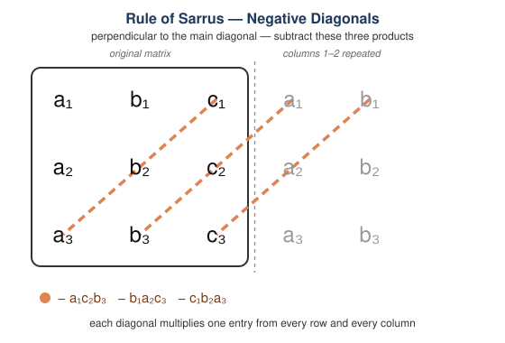

# Lesson 7: Three-Variable Systems — Determinants and Solution Count
*Fundamental Math / Algebra I*

Lesson 4's Class Practice 5 and 6 showed something unsettling: two three-variable systems
with the **exact same coefficients** but different constants landed in different cases —
one had no solution, the other had infinitely many — even though no pair of equations
looked unusual by itself. Lesson 5 handled this classification for two-variable systems by
comparing slopes and intercepts directly. This lesson introduces the three-variable
analogue: a single number, the **determinant** of the coefficient matrix, computed straight
from the coefficients, that predicts the solution count without running elimination first.
We start with **homogeneous** systems, where the determinant rule is cleanest, then extend
it to general systems.

## 1. Homogeneous Systems and the Trivial Solution

A system is **homogeneous** if every constant term is $0$:

$$
\begin{cases}
a_1x + b_1y + c_1z = 0 \\
a_2x + b_2y + c_2z = 0 \\
a_3x + b_3y + c_3z = 0
\end{cases}
$$

Every homogeneous system has at least one solution for free: $(x, y, z) = (0, 0, 0)$
plainly satisfies each equation, since every left-hand side becomes $0$. This is called the
**trivial solution**. So a homogeneous system is never the "no solution" case — the only
question is whether $(0,0,0)$ is the *only* solution, or whether other, **nontrivial**
solutions exist alongside it.

That question has a sharp answer, and it isn't "maybe a few more." Suppose $(x_0, y_0, z_0)$
is *any* nontrivial solution. Then for **every** real number $t$, the scaled triple
$(tx_0, ty_0, tz_0)$ is also a solution — plug it into equation $i$:

$$
a_i(tx_0) + b_i(ty_0) + c_i(tz_0) = t(a_ix_0 + b_iy_0 + c_iz_0) = t(0) = 0
$$

Every equation still holds, no matter what $t$ is. So a single nontrivial solution drags
along an entire line of solutions through the origin — infinitely many. A homogeneous
three-variable system therefore always lands in exactly one of two cases:

- **Only the trivial solution**, $(0,0,0)$.
- **Infinitely many solutions** — a whole line (or larger) of triples through the origin.

## 2. Reading Example: Only the Trivial Solution

$$
\begin{cases}
x + y + z = 0 & (1) \\
x - y + z = 0 & (2) \\
x + y - z = 0 & (3)
\end{cases}
$$

Subtract (2) from (1): $(x+y+z) - (x-y+z) = 0 \implies 2y = 0 \implies y = 0$.

Subtract (3) from (1): $(x+y+z) - (x+y-z) = 0 \implies 2z = 0 \implies z = 0$.

Substitute into (1): $x + 0 + 0 = 0 \implies x = 0$. The only solution is $(0, 0, 0)$ — the
trivial one, and nothing else.

## 3. Reading Example: Infinitely Many Solutions, No Two Equations Proportional

$$
\begin{cases}
x + y + z = 0 & (1) \\
2x - y + z = 0 & (2) \\
3x + 2z = 0 & (3)
\end{cases}
$$

Check the coefficients first: $(1,1,1)$, $(2,-1,1)$, and $(3,0,2)$ — no two of these triples
are scalar multiples of each other, so unlike Lesson 5's two-variable case, there's no
obvious "these two equations are the same line" shortcut to spot here.

Eliminate $z$ using (1) and (2): $(2x-y+z) - (x+y+z) = 0 \implies x - 2y = 0 \implies x =
2y$. Substitute into (1): $2y + y + z = 0 \implies z = -3y$. So every solution has the form

$$
(x, y, z) = (2y,\ y,\ -3y) = y(2, 1, -3)
$$

Check (3): $3(2y) + 2(-3y) = 6y - 6y = 0$ ✓ — true for **every** value of $y$. So (3) never
rules anything out; it's already implied by (1) and (2) combined. The system has
**infinitely many solutions**, a full line through the origin, even though checking any two
equations at a time gives no hint that a dependency is coming. This is the three-variable
version of Lesson 4's Class Practice 5 and 6: the redundancy is spread across all three
equations at once, not visible in any single pair.

**Non-obvious detail:** equation (3) here is exactly equation (1) plus equation (2):
$(1+2, 1-1, 1+1) = (3, 0, 2)$. That hidden sum is *why* the system has infinitely many
solutions, but nothing about the individual coefficients advertises it — you'd only notice
by trying the addition, or by the test in Section 4 below.

## 4. Core Template: The Determinant Test for Homogeneous Systems

Checking pairs by hand doesn't scale, and trying random combinations (like "is equation (3)
equal to (1) + (2)?") isn't a repeatable method. The determinant is a single number, built
directly from the nine coefficients, that settles the question every time.

For a coefficient matrix, its **determinant** is computed with the **Rule of Sarrus**: copy
columns 1 and 2 again to the right of the matrix, then multiply along three diagonals
running down-right (parallel to the main diagonal $a_1, b_2, c_3$) and three diagonals
running down-left (parallel to the other diagonal, perpendicular to the main one). Add the
three down-right products and subtract the three down-left products:

$$
\begin{vmatrix}
a_1 & b_1 & c_1 \\
a_2 & b_2 & c_2 \\
a_3 & b_3 & c_3
\end{vmatrix}
= \underbrace{a_1b_2c_3 + b_1c_2a_3 + c_1a_2b_3}_{\text{down-right diagonals}}
\;-\; (\underbrace{a_1c_2b_3 + b_1a_2c_3 + c_1b_2a_3}_{\text{down-left diagonals}})
$$

> **Careful — the Rule of Sarrus is 3×3 only.** The repeated-columns diagonal trick above
> does *not* generalize to a $4\times4$ system or larger; applying it there gives a wrong
> answer, not just a harder one. Bigger systems (four variables, five variables, …) have
> their own version of "one number that predicts the solution count," but computing it
> takes a different method than copying diagonals. That's a topic for a college Linear
> Algebra course, not this one — for now, this trick is a 3×3 tool only.

Treat this as a magic formula for now — plug in the nine coefficients (never the constants
on the right-hand side) in the pattern shown, and it produces one number. The rule for
homogeneous systems:

$$
\boxed{\text{determinant} \ne 0 \implies \text{only the trivial solution} \qquad
\text{determinant} = 0 \implies \text{infinitely many solutions}}
$$

**Verify against Section 2** (only the trivial solution): coefficients $(1,1,1)$,
$(1,-1,1)$, $(1,1,-1)$.

$$
\begin{vmatrix} 1 & 1 & 1 \\ 1 & -1 & 1 \\ 1 & 1 & -1 \end{vmatrix}
= 1\big[(-1)(-1) - (1)(1)\big] - 1\big[(1)(-1) - (1)(1)\big] + 1\big[(1)(1) - (-1)(1)\big]
$$

$$
= 1(1-1) - 1(-1-1) + 1(1+1) = 0 + 2 + 2 = 4 \ne 0
$$

Nonzero — matches the trivial-only result found by elimination.

**Verify against Section 3** (infinitely many solutions): coefficients $(1,1,1)$,
$(2,-1,1)$, $(3,0,2)$.

$$
\begin{vmatrix} 1 & 1 & 1 \\ 2 & -1 & 1 \\ 3 & 0 & 2 \end{vmatrix}
= 1\big[(-1)(2) - (1)(0)\big] - 1\big[(2)(2) - (1)(3)\big] + 1\big[(2)(0) - (-1)(3)\big]
$$

$$
= 1(-2-0) - 1(4-3) + 1(0+3) = -2 - 1 + 3 = 0
$$

Zero — matches the infinitely-many-solutions result found by elimination. In both cases the
determinant predicted the outcome without needing to run elimination at all.

## 5. Reading Example: Non-Homogeneous Systems and the Same Determinant

The determinant test extends directly to systems whose constants **aren't** all zero — the
determinant is still computed from the coefficients only, ignoring the constants entirely:

$$
\boxed{\text{determinant} \ne 0 \implies \text{exactly one solution} \qquad
\text{determinant} = 0 \implies \text{no solution, or infinitely many}}
$$

**Nonzero case.** Recall Lesson 4 Section 4's system, which was solved by elimination down
to $(2, -1, 3)$:

$$
\begin{cases}
2x + 3y - z = -2 \\
3x - 2y + 4z = 20 \\
4x + y + 2z = 13
\end{cases}
$$

$$
\begin{vmatrix} 2 & 3 & -1 \\ 3 & -2 & 4 \\ 4 & 1 & 2 \end{vmatrix}
= 2\big[(-2)(2)-(4)(1)\big] - 3\big[(3)(2)-(4)(4)\big] + (-1)\big[(3)(1)-(-2)(4)\big]
$$

$$
= 2(-4-4) - 3(6-16) - 1(3+8) = -16 + 30 - 11 = 3 \ne 0
$$

Nonzero, exactly as the earlier full elimination confirmed: one unique solution.

**Zero case — the determinant can't finish the job alone.** Recall Lesson 4's Class
Practice 5 and 6, which shared this coefficient matrix:

$$
\begin{vmatrix} 1 & 2 & 3 \\ 2 & 1 & -1 \\ 3 & 3 & 2 \end{vmatrix}
= 1\big[(1)(2)-(-1)(3)\big] - 2\big[(2)(2)-(-1)(3)\big] + 3\big[(2)(3)-(1)(3)\big]
$$

$$
= 1(2+3) - 2(4+3) + 3(6-3) = 5 - 14 + 9 = 0
$$

The determinant is $0$ — so this system is *either* no solution *or* infinitely many, and
the determinant alone can't say which. That matches exactly what happened: Class Practice
5's constants $(6, 3, 10)$ produced a contradiction ($0 = 1$) and **no solution**; Class
Practice 6's constants $(6, 3, 9)$ — changing only the very last number — produced a
tautology ($3y+7z = 3y+7z$) and **infinitely many solutions**. The determinant only depends
on the coefficients, so it's identical for both systems; distinguishing the two outcomes is
only possible by actually eliminating and reading the leftover statement, exactly the way
Lesson 5 read $0 = k$ versus $0 = 0$ for two-variable systems.

**Non-obvious detail:** a nonzero determinant is a genuine shortcut — it guarantees a unique
solution without any elimination. A zero determinant saves no work at all beyond narrowing
the question to "no solution or infinite" — the elimination has to be run regardless, to see
whether the combined equations contradict each other or collapse to $0=0$.

## 6. Class Practice 1: Homogeneous System, Determinant Says Trivial Only

### Problem

Using the determinant, determine whether this homogeneous system has only the trivial
solution or infinitely many solutions. Do not solve the system directly.

$$
\begin{cases}
x + y + 2z = 0 \\
2x - y + z = 0 \\
x + 2y - z = 0
\end{cases}
$$

Solution

$$
\begin{vmatrix} 1 & 1 & 2 \\ 2 & -1 & 1 \\ 1 & 2 & -1 \end{vmatrix}
= 1\big[(-1)(-1)-(1)(2)\big] - 1\big[(2)(-1)-(1)(1)\big] + 2\big[(2)(2)-(-1)(1)\big]
$$

$$
= 1(1-2) - 1(-2-1) + 2(4+1) = -1 + 3 + 10 = 12 \ne 0
$$

The determinant is nonzero.

The answer is **only the trivial solution, $(0,0,0)$**.

## 7. Class Practice 2: Homogeneous System, No Two Equations Proportional, Yet Dependent

### Problem

Using the determinant, determine whether this homogeneous system has only the trivial
solution or infinitely many solutions. If infinitely many, describe the solution set.

$$
\begin{cases}
x + 2y - z = 0 \\
3x - y + 2z = 0 \\
4x + y + z = 0
\end{cases}
$$

Solution

$$
\begin{vmatrix} 1 & 2 & -1 \\ 3 & -1 & 2 \\ 4 & 1 & 1 \end{vmatrix}
= 1\big[(-1)(1)-(2)(1)\big] - 2\big[(3)(1)-(2)(4)\big] + (-1)\big[(3)(1)-(-1)(4)\big]
$$

$$
= 1(-1-2) - 2(3-8) - 1(3+4) = -3 + 10 - 7 = 0
$$

The determinant is zero, so the system has infinitely many solutions. Solve using (1) and
(2): from (1), $x = z - 2y$. Substitute into (2):

$$
3(z-2y) - y + 2z = 0 \implies 3z - 6y - y + 2z = 0 \implies 5z = 7y \implies z = \frac{7y}{5}
$$

Let $y = 5t$, so $z = 7t$ and $x = 7t - 2(5t) = -3t$. Check (3): $4(-3t) + 5t + 7t =
-12t+12t = 0$ ✓ for every $t$.

The answer is **infinitely many solutions**, $(x, y, z) = t(-3, 5, 7)$ for any real $t$.

## 8. Class Practice 3: Non-Homogeneous System, Determinant Says Unique Solution

### Problem

Without fully solving, use the determinant to determine how many solutions this system has:

$$
\begin{cases}
x + y + 2z = 5 \\
2x - y + z = 1 \\
x + 2y - z = 4
\end{cases}
$$

Solution

The coefficients are identical to Class Practice 1's, whose determinant was already found
to be $12 \ne 0$. Only the constants changed, and the determinant doesn't depend on the
constants at all — so the determinant is still $12 \ne 0$.

The answer is **exactly one solution**.

## 9. Class Practice 4: Non-Homogeneous System, Determinant Zero, Elimination Required

### Problem

Solve the system for $(x, y, z)$, or show that it has no solution:

$$
\begin{cases}
x + 2y - z = 3 \\
3x - y + 2z = 1 \\
4x + y + z = 5
\end{cases}
$$

Solution

The coefficients match Class Practice 2's, whose determinant was already found to be $0$.
So this system is either no solution or infinitely many — the determinant alone can't say
which, and the constants here are different from Class Practice 2's (all zero), so that
example's answer doesn't carry over. Elimination is required.

Eliminate $x$ from (1) and (2): $(3x-y+2z) - 3(x+2y-z) = 1 - 3(3)$

$$
3x - y + 2z - 3x - 6y + 3z = 1 - 9 \implies -7y + 5z = -8 \qquad (A)
$$

Eliminate $x$ from (1) and (3): $(4x+y+z) - 4(x+2y-z) = 5 - 4(3)$

$$
4x + y + z - 4x - 8y + 4z = 5 - 12 \implies -7y + 5z = -7 \qquad (B)
$$

(A) and (B) have the **exact same left-hand side** but different right-hand sides.
Subtracting:

$$
(-7y+5z) - (-7y+5z) = -8 - (-7) \implies 0 = -1
$$

A false statement.

The answer is **no solution** — even though the determinant only narrowed the case down to
"no solution or infinite," and no two of the three equations are proportional to each
other.

## 10. Common Mistakes

### 10.1 Treating a zero determinant as automatically meaning infinitely many solutions

This is true for **homogeneous** systems (Section 4) but not for general ones (Section 5,
Class Practice 4) — a homogeneous system can't have "no solution" because $(0,0,0)$ always
works, but a non-homogeneous system with determinant $0$ can go either way. Always check
whether the constants are all zero before assuming which half of the rule applies.

### 10.2 Expecting two proportional equations before believing a dependency exists

The two-variable habit from Lesson 5 — compare slopes to spot a repeated line — doesn't
transfer directly. Section 3 and Class Practice 2 both show homogeneous systems where no
pair of equations is proportional, yet the determinant is still $0$ and the system still
has infinitely many solutions. The dependency can be spread across all three equations
(e.g. equation (3) equals equation (1) plus equation (2)) instead of hiding in a single
pair.

### 10.3 Stopping at "determinant is zero" without solving

A zero determinant for a non-homogeneous system is the start of the analysis, not the end —
it only tells you the answer is no solution or infinite, not which. Class Practice 4 shows
the elimination is unavoidable in that case; skip it and you're guessing between two
different answers.

## 11. Key Takeaways

- A homogeneous three-variable system always has the trivial solution $(0,0,0)$, so it's
  never the "no solution" case — the only question is whether other solutions exist too.
- Any nontrivial solution to a homogeneous system drags along infinitely many others (every
  scalar multiple also works), so the outcome is always exactly one of two cases: trivial
  only, or infinitely many.
- The determinant of the coefficient matrix — computed from the nine coefficients alone,
  never the constants — predicts the homogeneous case directly: nonzero means trivial only,
  zero means infinitely many.
- For non-homogeneous systems, the same determinant extends the rule: nonzero guarantees
  exactly one solution; zero narrows it to "no solution or infinitely many" but can't
  distinguish them — elimination is still required, checking whether the leftover statement
  is a contradiction ($0 = k$, $k \ne 0$) or a tautology ($0 = 0$), the three-variable
  version of Lesson 5's check.
- No two equations need to be proportional for a three-variable system to be dependent —
  the redundancy (or contradiction) can be hidden across all three equations at once, as
  Lesson 4's Class Practice 5–6 and this lesson's examples both show.
