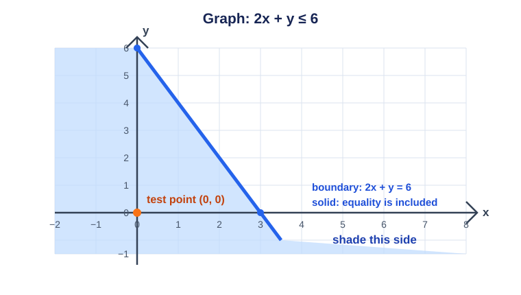
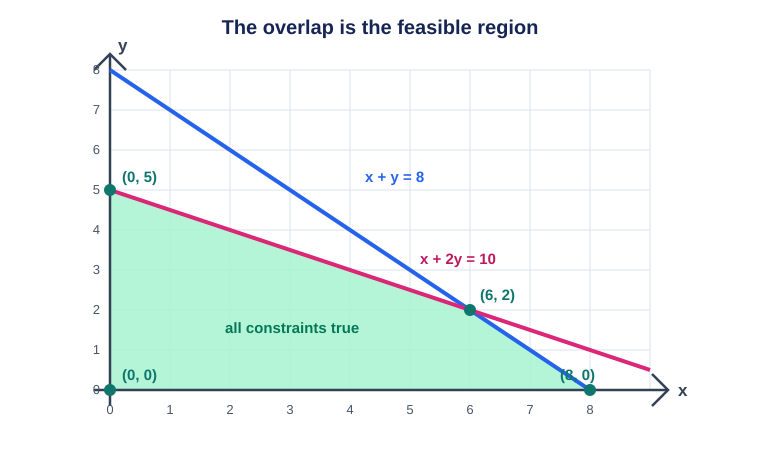
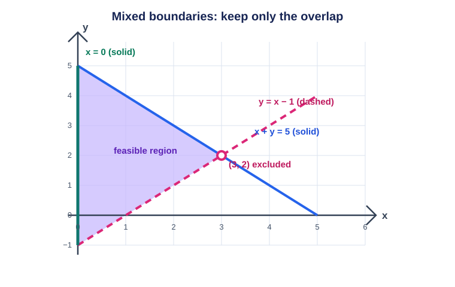
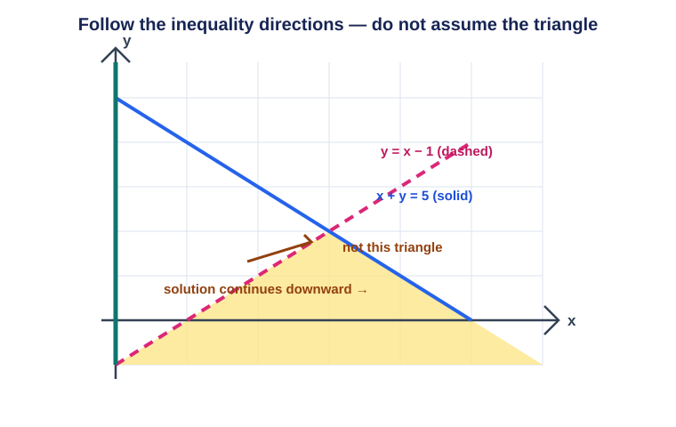
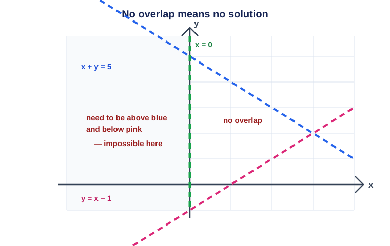

# Lesson 10: Two-Variable Inequalities — Graphing the Area
*Fundamental Math / Algebra I*

An equation such as $y=2x+1$ describes the points *on* one line. An inequality such as
$y\le2x+1$ describes a whole side of that line: every point whose $y$-value is at or below
the line. This lesson turns each constraint into a shaded region, then finds the overlap
that satisfies every constraint.

## 1. Boundary Line and Shaded Side

First graph the **boundary line**: replace the inequality sign with an equals sign. The line
separates the plane into two half-planes; one side makes the inequality true.

- Use a **solid** boundary for $\le$ or $\ge$: equality is included.
- Use a **dashed** boundary for $<$ or $>$: equality is excluded.

When the inequality is solved for $y$, the direction reveals the side:

$$y>mx+b\text{ or }y\ge mx+b \Rightarrow \text{shade above},$$
$$y<mx+b\text{ or }y\le mx+b \Rightarrow \text{shade below}.$$

For any other form, use a **test point**. Choose a point not on the boundary, substitute it
into the original inequality, and shade its side if the statement is true. The origin
$(0,0)$ is convenient unless it lies on the boundary.

**Example.** Graph $2x+y\le6$.

1. Its boundary is $2x+y=6$, or $y=-2x+6$, through $(0,6)$ and $(3,0)$.
2. Draw it solid because $\le$ includes equality.
3. Test $(0,0)$: $2(0)+0\le6$ is true. Shade the side containing $(0,0)$ — below the line.

The method also handles vertical boundaries. For $x\ge2$, draw solid $x=2$. The test point
$(0,0)$ fails, so shade on the right.

## 2. Systems: The Feasible Region

A **system of inequalities** requires every condition at once. Graph each constraint, then
keep only the overlap. This overlap is the **feasible region**, the set of all possible
$(x,y)$ pairs that meet every condition. For quantities such as products or hours, also
include $x\ge0$ and $y\ge0$ when negative values make no sense.

**Example.** Graph the feasible region for

$$
\begin{cases}
x+y\le8\\
x+2y\le10\\
x\ge0,\ y\ge0.
\end{cases}
$$

Both diagonal boundaries are solid. Shade below each and keep the first quadrant. The
overlap has vertices $(0,0)$, $(8,0)$, $(6,2)$, and $(0,5)$. The non-axis corner comes from
solving the boundary equations:

$$x+y=8,\quad x+2y=10 \Rightarrow y=2,\ x=6.$$

This is the same systems skill from earlier lessons: the equations locate exact boundary
intersections.

## 3. Careful Algebra: Reversing the Sign

Adding or subtracting the same quantity preserves an inequality. Multiplying or dividing by
a **negative** reverses it:

$$-2y>8-4x \Rightarrow y<-4+2x.$$

Negative multiplication reverses order: $3<5$, but $-3>-5$. Forgetting the flip shades the
wrong half-plane.

## 4. Reading Example: Mixed Boundaries

Graph

$$
\begin{cases}
y>x-1\\
x+y\le5\\
x\ge0.
\end{cases}
$$

- Draw $y=x-1$ **dashed**; shade above it.
- Rewrite $x+y\le5$ as $y\le-x+5$; draw it **solid** and shade below.
- Draw $x=0$ solid and shade to its right.

The feasible region is the wedge meeting all three conditions. The diagonal boundaries meet
at $(3,2)$, but that point is excluded because it lies on the dashed boundary.

## 5. Reading Example: Same Lines, an Unbounded Open Region

Keep the same boundary lines, but flip the first direction:

$$
\begin{cases}
y < x-1\\
x+y \le5\\
x\ge0.
\end{cases}
$$

The line $y=x-1$ is still dashed, but now shade **below** it. The second inequality still
shades below $x+y=5$, and $x\ge0$ still shades right of the $y$-axis. The answer is the
region below *both* diagonal lines. It is not the enclosed-looking triangle between them;
it continues indefinitely downward (and then rightward below $x+y=5$).

The point $(1,-2)$ is a quick check: $-2<1-1$, $1+(-2)\le5$, and $1\ge0$, so it belongs.
It sits outside the triangle, confirming that the triangle cannot be the answer.

## 6. Reading Example: Flip Every Direction — No Solution

Now flip **every** inequality direction from Reading Example 4. The boundary lines are
unchanged:

$$
\begin{cases}
y < x-1\\
x+y >5\\
x<0.
\end{cases}
$$

The condition $x<0$ restricts us to the left of the $y$-axis. There, $x+y>5$ means
$y>5-x$, while $y<x-1$ means $y$ must be below $x-1$. But when $x<0$,

$$5-x > x-1,$$

so the required lower value $5-x$ is always *above* the required upper value $x-1$. No
$y$ can be both greater than the first and less than the second. The system has
$\boxed{\text{no solution}}$.

## 7. Class Practice 1: One Inequality

### Problem

Graph $3x-2y>6$. State the boundary style and give one point in the solution region.

Solution

$$-2y>6-3x \Rightarrow y<\frac32x-3.$$

The boundary $y=\tfrac32x-3$ is **dashed** because the inequality is strict; shade below.
For example, $(0,-4)$ works because $3(0)-2(-4)=8>6$.

## 8. Class Practice 2: Feasible-Region Vertices

### Problem

Find all vertices of the feasible region:

$$
\begin{cases}
x+y\le12\\
x+3y\le18\\
x\ge0,\ y\ge0.
\end{cases}
$$

Solution

The axis vertices are $(0,0)$, $(12,0)$, and $(0,6)$. Solve the diagonal boundaries:
$x+y=12$ and $x+3y=18$. Subtracting gives $2y=6$, so $y=3$ and $x=9$.

$$\boxed{(0,0),\ (12,0),\ (9,3),\ (0,6)}$$

## 9. Class Practice 3: Does a Point Work?

### Problem

Does $(4,3)$ lie in the feasible region for $x+2y\le11$, $3x+y\le15$, $x\ge0$, $y\ge0$?

Solution

$$4+2(3)=10\le11,\qquad3(4)+3=15\le15,$$

and both coordinates are nonnegative. Thus $\boxed{(4,3)}$ is in the feasible region. It
lies on $3x+y=15$, which is allowed because the sign is $\le$.

## 10. Common Mistakes

### 10.1 Wrong line style

$y<2x+1$ and $y\le2x+1$ use the same boundary equation but not the same answer set: the
first needs a dashed line and the second a solid one.

### 10.2 Testing a boundary point

A boundary point makes the equality true, so it cannot identify the shaded side. Pick a
point clearly on one side.

### 10.3 Keeping a region that meets only one condition

For a system, the answer is the **overlap**, not every shaded part of every graph.

## 11. Key Takeaways

- Replace the inequality with $=$ to draw its boundary.
- Solid for $\le,\ge$; dashed for $<,>$.
- Shade above for $y>$ or $y\ge$, below for $y<$ or $y\le$; otherwise use a test point.
- Reverse the sign when multiplying or dividing by a negative.
- The overlap is the feasible region; solve boundary equations to find exact vertices.
