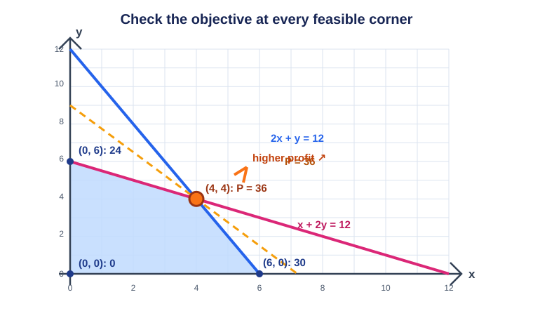
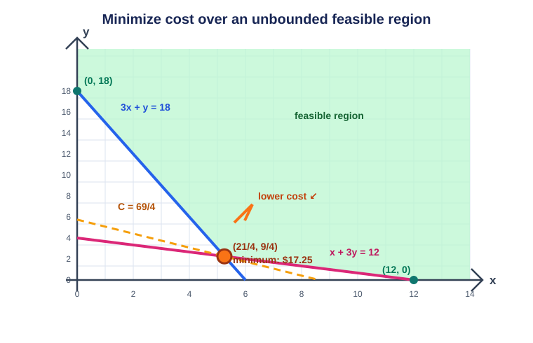

# Lesson 11: Linear Programming — Optimizing With Constraints
*Fundamental Math / Algebra I*

Lesson 10 produced a **feasible region**: the choices satisfying all constraints. Linear
programming adds a goal: among feasible choices, which maximizes or minimizes a linear
quantity such as profit, cost, or revenue?

## 1. The Model

A two-variable linear-programming model has:

- **Decision variables**, for example $x$ notebooks and $y$ planners.
- **Constraints**, inequalities describing limits; their overlap is the feasible region.
- An **objective function**, such as $P=5x+4y$, to maximize or minimize.

For counts of things, include $x\ge0$ and $y\ge0$. Negative products, tickets, or hours
are not valid choices.

## 2. The Corner-Point Method

For a closed, bounded feasible polygon, a linear objective reaches an optimum at a
**vertex**. Use this process:

1. Define variables and translate the context into constraints and an objective.
2. Graph the constraints and identify the feasible region.
3. Find every vertex using intercepts and intersections of boundary equations.
4. Evaluate the objective at each feasible vertex.
5. Select the greatest value for a maximum or the least value for a minimum, and interpret
   its vertex in context.

Equal-value lines, such as $5x+4y=40$, are parallel. Sliding one in the direction of a
larger value makes its final contact with the feasible polygon occur at a corner (or,
occasionally, along an entire edge). That is why checking corners works.

## 3. Worked Example: Maximize Profit

A shop makes notebooks ($x$) and planners ($y$). A notebook uses 2 machine minutes and 1
unit of material; a planner uses 1 machine minute and 2 material units. There are at most
12 minutes and 12 material units. Profit is $\$5$ per notebook and $\$4$ per planner.

$$
2x+y\le12,\qquad x+2y\le12,\qquad x,y\ge0,\qquad P=5x+4y.
$$

The feasible-region vertices are $(0,0)$, $(6,0)$, $(4,4)$, and $(0,6)$. The middle one
comes from solving $2x+y=12$ with $x+2y=12$.

| Vertex $(x,y)$ | $P=5x+4y$ |
| --- | ---: |
| $(0,0)$ | $\$0$ |
| $(6,0)$ | $\$30$ |
| $(4,4)$ | $\$36$ |
| $(0,6)$ | $\$24$ |

The maximum is $\boxed{\$36}$ at $\boxed{(4,4)}$. Make 4 notebooks and 4 planners.

## 4. Worked Example: Minimize Cost

A cafeteria needs at least 18 grams of protein and 12 grams of fiber. Food A ($x$) supplies
3 grams protein and 1 gram fiber and costs $\$2$ per bowl. Food B ($y$) supplies 1 gram
protein and 3 grams fiber and costs $\$3$. Fractional bowls are allowed in this model.

$$
3x+y\ge18,\qquad x+3y\ge12,\qquad x,y\ge0,\qquad C=2x+3y.
$$

The lower-edge vertices are $(0,18)$, $(12,0)$, and the line intersection
$\left(\tfrac{21}{4},\tfrac94\right)$.

| Vertex $(x,y)$ | $C=2x+3y$ |
| --- | ---: |
| $(0,18)$ | $\$54$ |
| $(12,0)$ | $\$24$ |
| $(\tfrac{21}{4},\tfrac94)$ | $\$\tfrac{69}{4}=\$17.25$ |

The minimum is $\boxed{\$17.25}$ at $\boxed{(\tfrac{21}{4},\tfrac94)}$. This region is
unbounded, but it can still have a minimum. Verify every candidate meets every constraint.

## 5. Special Outcomes

- A tie can occur along an edge. Maximizing $2x+2y$ subject to $x+y\le10$, $x,y\ge0$ gives
  20 at every point on $x+y=10$.
- An unbounded region can mean no maximum or no minimum. Maximizing $x+y$ subject to
  $x+y\ge5$, $x,y\ge0$ has no maximum.
- If constraints have no overlap, there is no feasible solution to optimize.

## 6. Class Practice 1: Maximize Revenue

### Problem

A club sells regular tickets ($x$) for $\$8$ and VIP tickets ($y$) for $\$12$. It sells at
most 40 tickets total and at most 24 VIP tickets. Find the maximum revenue.

Solution

Constraints: $x+y\le40$, $y\le24$, $x,y\ge0$. The vertices are $(0,0)$, $(40,0)$,
$(16,24)$, and $(0,24)$. For $R=8x+12y$, the values are $0$, $320$, $416$, and $288$.

The maximum revenue is $\boxed{\$416}$ from $\boxed{16}$ regular and $\boxed{24}$ VIP
tickets.

## 7. Class Practice 2: Build and Solve a Model

### Problem

A gardener plants $x$ rose bushes and $y$ lavender plants. Each rose needs 3 square feet
and 2 liters of water; each lavender needs 2 square feet and 1 liter. There are at most 36
square feet and 20 liters. Profit is $\$7$ per rose and $\$4$ per lavender. Write a model,
then find the maximum profit.

Solution

$$3x+2y\le36,\qquad2x+y\le20,\qquad x,y\ge0,\qquad P=7x+4y.$$

The vertices are $(0,0)$, $(10,0)$, $(4,12)$, and $(0,18)$. Their profits are $0$, $70$,
$76$, and $72$. The greatest is $\boxed{\$76}$ at $\boxed{(4,12)}$: 4 roses and 12
lavender plants.

## 8. Common Mistakes

### 8.1 Optimizing an infeasible point

Compare only feasible vertices. A large objective value is irrelevant if one constraint is
violated.

### 8.2 Missing an axis corner

The intersections with $x=0$ and $y=0$ are often vertices. Graph nonnegativity constraints.

### 8.3 Reversing context words

"At most" means $\le$; "at least" means $\ge$. A reversal changes the feasible region.

### 8.4 Reporting only the objective value

Give both the optimal value and the decision $(x,y)$ that achieves it.

## 9. Key Takeaways

- Linear programming optimizes a linear objective under linear constraints.
- The constraints' overlap is the feasible region.
- Evaluate the objective at every feasible vertex.
- State the winning decision as well as its value, and check all constraints.
