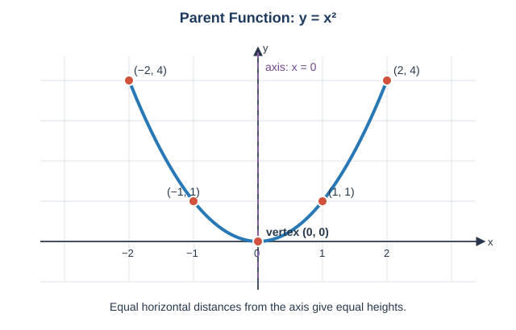
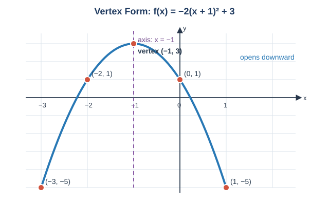
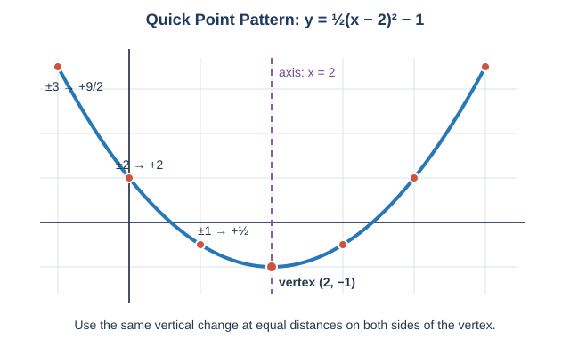
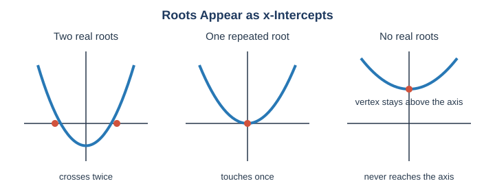
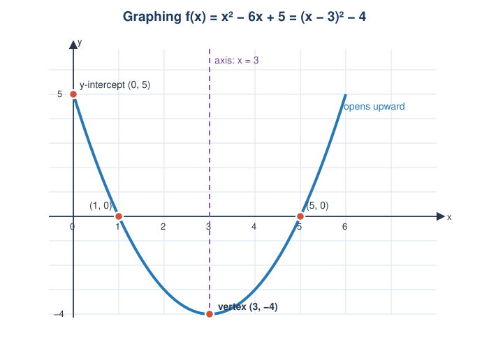
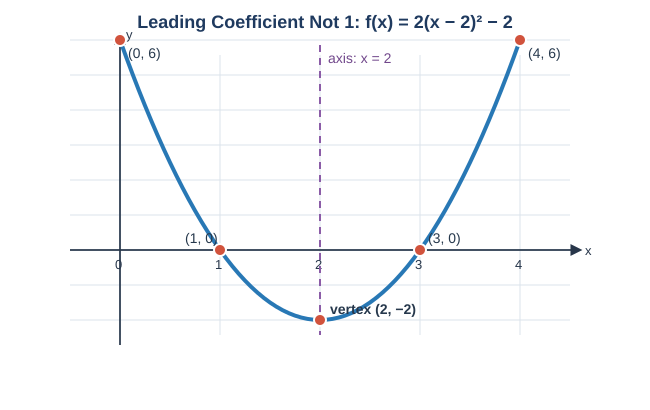
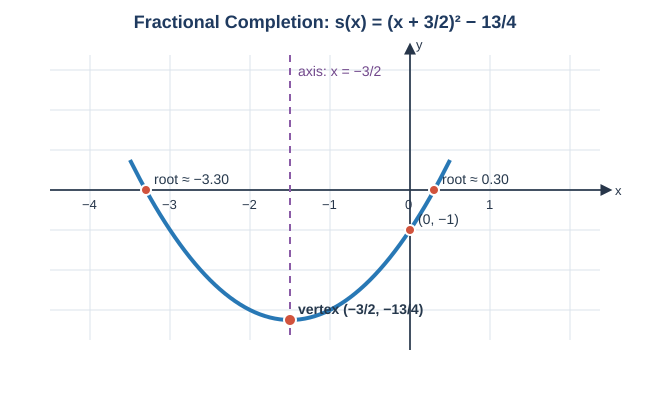

# Lesson 13: Graphing Quadratic Functions
*Fundamental Math / Algebra I*

A quadratic function has the form $f(x)=ax^2+bx+c$, where $a\ne0$. Its graph is a
**parabola**: a U-shaped curve (or an upside-down U) with a single turning point. In this
lesson, we will graph parabolas by identifying their vertex, axis of symmetry, direction,
and intercepts. Completing the square now has a new purpose: it reveals a graph's vertex.

## 1. The Parent Function: $y=x^2$

The simplest quadratic function is $y=x^2$. A small table gives points for its graph:

| $x$ | $-2$ | $-1$ | $0$ | $1$ | $2$ |
| ---: | ---: | ---: | ---: | ---: | ---: |
| $y=x^2$ | $4$ | $1$ | $0$ | $1$ | $4$ |

The graph has its lowest point at $(0,0)$ and opens upward. The points at equal distances
left and right of $0$ have the same height: $(-2,4)$ matches $(2,4)$, and $(-1,1)$ matches
$(1,1)$. The vertical line $x=0$ that divides those matching halves is the **axis of
symmetry**.

## 2. Vertex Form Shows the Graph Immediately

The most useful form for graphing is **vertex form**:

$$f(x)=a(x-h)^2+k.$$

- The **vertex** is $(h,k)$, the parabola's turning point.
- The **axis of symmetry** is $x=h$.
- If $a>0$, the parabola opens upward and its vertex is a minimum.
- If $a<0$, it opens downward and its vertex is a maximum.
- If $|a|>1$, it is narrower than $y=x^2$; if $0<|a|<1$, it is wider.

The signs inside the parentheses deserve care: $f(x)=(x+3)^2-2$ has $h=-3$, so its vertex
is $(-3,-2)$, not $(3,-2)$.

### Reading Example: Graph From Vertex Form

Describe and plot key points for

$$f(x)=-2(x+1)^2+3.$$

The vertex is $(-1,3)$, the axis is $x=-1$, and the graph opens downward because $a=-2$.
Start at the vertex and use symmetric inputs:

| $x$ | $-3$ | $-2$ | $-1$ | $0$ | $1$ |
| ---: | ---: | ---: | ---: | ---: | ---: |
| $f(x)$ | $-5$ | $1$ | $3$ | $1$ | $-5$ |

Plot $(-1,3)$, $(-2,1)$, $(0,1)$, $(-3,-5)$, and $(1,-5)$, then draw a smooth downward
curve through them. The matching pairs make the symmetry visible.

## 3. A Quick Point Pattern From the Vertex

For $y=x^2$, moving $1$ unit horizontally from the vertex changes $y$ by $1$; moving $2$
units changes $y$ by $4$; moving $3$ units changes $y$ by $9$. For

$$y=a(x-h)^2+k,$$

start at $(h,k)$ and use vertical changes $a(1)$, $a(4)$, and $a(9)$ at horizontal distances
$1$, $2$, and $3$ on **both** sides of the axis.

For example, from the vertex of $y=\frac12(x-2)^2-1$:

- move $1$ left and right, then move $\frac12$ up;
- move $2$ left and right, then move $2$ up;
- move $3$ left and right, then move $\frac92$ up.

This is often faster than making a long table, and it guarantees symmetric points.

## 4. Intercepts Connect a Graph to an Equation

The **$y$-intercept** occurs where $x=0$. Substitute $0$ into $f(x)$.

The **$x$-intercepts** occur where $y=0$, so solve

$$f(x)=0.$$

Thus, the roots from Lesson 12 are exactly the $x$-coordinates where the parabola crosses
or touches the $x$-axis.

- Two real roots give two $x$-intercepts.
- One repeated real root gives one $x$-intercept where the parabola touches the axis.
- No real roots give no $x$-intercepts.

## 5. From Standard Form to a Graph: Complete the Square

In **standard form**, $f(x)=ax^2+bx+c$, the constant $c$ is immediately the $y$-intercept:

$$f(0)=c.$$

The vertex is less obvious. Complete the square to rewrite standard form as vertex form.

### Reading Example: Reveal the Vertex

Graph $f(x)=x^2-6x+5$.

First use completing the square:

$$
\begin{aligned}
f(x)&=x^2-6x+5\\
&=x^2-6x+9-9+5\\
&=(x-3)^2-4.
\end{aligned}
$$

Now the graph information is clear:

- vertex: $(3,-4)$;
- axis of symmetry: $x=3$;
- opening: upward, since $a=1$;
- $y$-intercept: $(0,5)$.

To find the $x$-intercepts, set the function equal to zero:

$$
\begin{aligned}
(x-3)^2-4&=0\\
(x-3)^2&=4\\
x-3&=\pm2.
\end{aligned}
$$

So $x=1$ or $x=5$, giving intercepts $(1,0)$ and $(5,0)$. These points are equally far
from the axis $x=3$, which is a useful check. Plot the vertex, intercepts, and
$y$-intercept; then use symmetry to sketch the parabola.

### Reading Example: Complete the Square When $a\ne1$

Graph $r(x)=2x^2-8x+6$. When the leading coefficient is not $1$, first factor it from
the quadratic and linear terms. Then complete the square **inside** the parentheses:

$$
\begin{aligned}
r(x)&=2(x^2-4x)+6\\
&=2\bigl[(x^2-4x+4)-4\bigr]+6\\
&=2(x-2)^2-8+6\\
&=2(x-2)^2-2.
\end{aligned}
$$

The factor $2$ stays outside the square. Therefore the vertex is $(2,-2)$, the axis is
$x=2$, and the parabola opens upward and is narrower than $y=x^2$. The $y$-intercept is
$(0,6)$. For the $x$-intercepts:

$$2(x-2)^2-2=0 \implies (x-2)^2=1 \implies x=1\text{ or }x=3.$$

So the intercepts are $(1,0)$ and $(3,0)$.

**Complete-the-square strategy to remember:** factor out $a$ from the $x^2$ and $x$
terms, add and subtract the square of half the coefficient of $x$ *inside* the parentheses,
then distribute the outside factor back to the constant adjustment.

### Reading Example: Completing the Square With Fractions

Graph $s(x)=x^2+3x-1$. The coefficient of $x$ is odd, so half of it is a fraction. Keep
the fraction exact instead of converting it to a decimal:

$$
\begin{aligned}
s(x)&=x^2+3x-1\\
&=x^2+3x+\left(\frac32\right)^2-\left(\frac32\right)^2-1\\
&=\left(x+\frac32\right)^2-\frac94-1\\
&=\left(x+\frac32\right)^2-\frac{13}{4}.
\end{aligned}
$$

Thus the vertex is $\left(-\frac32,-\frac{13}{4}\right)$, the axis is
$x=-\frac32$, and the graph opens upward. The $y$-intercept is $(0,-1)$. Its
$x$-intercepts need not be integers:

$$
\left(x+\frac32\right)^2-\frac{13}{4}=0
\implies x=-\frac32\pm\frac{\sqrt{13}}2
=\frac{-3\pm\sqrt{13}}2.
$$

Exact fractions preserve the structure of the answer; use decimal approximations only when
you need to place the intercepts on a sketch.

## 6. Graphing Checklist

For a quadratic in vertex form, identify the vertex, axis, opening, and a few symmetric
points. For one in standard form, use this order:

1. Identify the opening from the sign of $a$.
2. Find the $y$-intercept by evaluating $f(0)$.
3. Complete the square to find vertex form, the vertex, and the axis.
4. Find $x$-intercepts by solving $f(x)=0$ when real roots exist.
5. Plot the key points and draw a smooth symmetric parabola.

The vertex is not always an intercept, and a parabola without real roots still has a vertex
and a $y$-intercept.

## 7. Class Practice 1: Read Vertex Form

### Problem

For $g(x)=3(x-2)^2-4$, state the vertex, axis of symmetry, opening direction, and the two
points one unit left and right of the vertex.

Solution

The vertex is $(2,-4)$ and the axis is $x=2$. Because $a=3>0$, the graph opens upward.
One unit from $x=2$ gives $(x-2)^2=1$, so $g(x)=3(1)-4=-1$.

The symmetric points are $(1,-1)$ and $(3,-1)$.

## 8. Class Practice 2: Graph From Standard Form

### Problem

Find the vertex, axis of symmetry, opening direction, and all intercepts of

$$h(x)=x^2+4x+3.$$

Solution

Complete the square:

$$h(x)=x^2+4x+4-4+3=(x+2)^2-1.$$

The vertex is $(-2,-1)$, the axis is $x=-2$, and the graph opens upward. The $y$-intercept
is $h(0)=3$, so it is $(0,3)$. For the $x$-intercepts:

$$
(x+2)^2-1=0 \implies (x+2)^2=1 \implies x+2=\pm1.
$$

Thus the $x$-intercepts are $(-1,0)$ and $(-3,0)$.

## 9. Class Practice 3: No $x$-Intercepts

### Problem

Graph the key features of $p(x)=x^2-2x+5$. Does its graph cross the $x$-axis?

Solution

$$p(x)=x^2-2x+1-1+5=(x-1)^2+4.$$

The vertex is $(1,4)$ and the axis is $x=1$. It opens upward. The $y$-intercept is
$(0,5)$; by symmetry, $(2,5)$ is another point. Since the vertex is above the $x$-axis and
the parabola opens upward, the graph never reaches the $x$-axis. It has no $x$-intercepts.

## 10. Class Practice 4: Leading Coefficient Not 1

### Problem

Rewrite $q(x)=-3x^2+12x-9$ in vertex form by completing the square. Then state its
vertex, axis, opening direction, and all intercepts.

Solution

Factor $-3$ from the quadratic and linear terms before completing the square:

$$
\begin{aligned}
q(x)&=-3(x^2-4x)-9\\
&=-3\bigl[(x^2-4x+4)-4\bigr]-9\\
&=-3(x-2)^2+12-9\\
&=-3(x-2)^2+3.
\end{aligned}
$$

The vertex is $(2,3)$ and the axis is $x=2$. Since the leading coefficient is negative,
the parabola opens downward. The $y$-intercept is $(0,-9)$. For the $x$-intercepts:

$$-3(x-2)^2+3=0 \implies (x-2)^2=1 \implies x=1\text{ or }x=3.$$

Thus the $x$-intercepts are $(1,0)$ and $(3,0)$.

## 11. Class Practice 5: Completing the Square With Fractions

### Problem

Rewrite $u(x)=x^2-5x+2$ in vertex form by completing the square. Then state its vertex,
axis of symmetry, and exact $x$-intercepts.

Solution

Half of $-5$ is $-\frac52$, so add and subtract $\left(\frac52\right)^2$:

$$
\begin{aligned}
u(x)&=x^2-5x+2\\
&=x^2-5x+\frac{25}{4}-\frac{25}{4}+2\\
&=\left(x-\frac52\right)^2-\frac{17}{4}.
\end{aligned}
$$

The vertex is $\left(\frac52,-\frac{17}{4}\right)$ and the axis is $x=\frac52$.
For the $x$-intercepts:

$$
\left(x-\frac52\right)^2=\frac{17}{4}
\implies x=\frac52\pm\frac{\sqrt{17}}2
=\frac{5\pm\sqrt{17}}2.
$$

## 12. Common Mistakes

### 12.1 Reversing the Horizontal Shift

In $(x+3)^2-2$, the vertex has $x$-coordinate $-3$, because $x+3=x-(-3)$.

### 12.2 Plotting Points on Only One Side

A parabola is symmetric about its axis. Each point to one side should have a reflected point
the same distance on the other side.

### 12.3 Confusing the $y$-Intercept and the Vertex

The $y$-intercept comes from $x=0$; the vertex comes from the squared expression being zero.
They coincide only in special cases.

### 12.4 Assuming Every Parabola Crosses the $x$-Axis

If completing the square produces $(x-h)^2=$ a negative number when $y=0$, the graph has no
real $x$-intercepts.

## 13. Key Takeaways

- Every quadratic graph is a parabola with a vertex and a vertical axis of symmetry.
- In $a(x-h)^2+k$, the vertex is $(h,k)$ and the axis is $x=h$.
- The sign of $a$ controls whether the graph opens up or down; its magnitude changes the
  parabola's width.
- The $y$-intercept is found with $x=0$; $x$-intercepts are the real roots of $f(x)=0$.
- Completing the square converts standard form into vertex form, revealing graph features
  without a new formula to memorize.
- When $a\ne1$, factor $a$ from the first two terms before completing the square.
- When half the linear coefficient is fractional, keep the fraction exact while completing
  the square.
