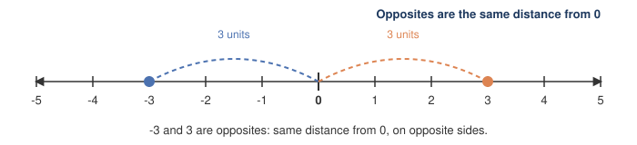
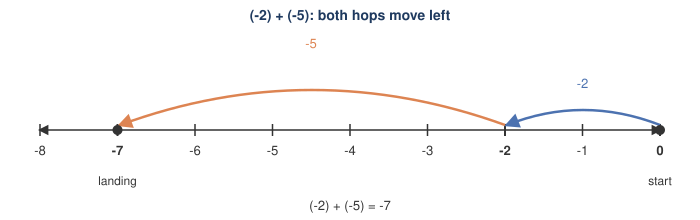
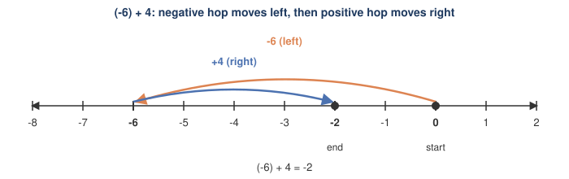

# Lesson 3: Negative Integers — Addition and Subtraction
*Fundamental Math / Course 2*

Up to now, numbers have measured "how much" of something. **Negative integers** let
numbers also measure *direction* — below zero, before a reference point, or owed instead
of owned. This lesson introduces negative integers and the rules for adding and
subtracting them.

## 1. What Is a Negative Integer?

The **integers** are the whole numbers together with their opposites and zero:

$$\ldots, -3, -2, -1, 0, 1, 2, 3, \ldots$$

Every nonzero integer $n$ has an **opposite**, $-n$, the same distance from $0$ but on the
other side. On a number line:

Negative integers show up whenever a quantity can go *below* a natural zero point:

- **Temperature:** $-5°$F is 5 degrees below zero.
- **Elevation:** $-40$ m is 40 meters below sea level.
- **Money:** a balance of $-20$ means you owe \$20.

**Absolute value**, written $|n|$, is the distance from $n$ to $0$ on the number line —
always nonnegative. So $|3| = 3$ and $|-3| = 3$: opposites have the same absolute value,
because they're the same distance from $0$ in opposite directions.

## 2. Number Line Model: Addition as Movement

Before the sign rules, here is a picture that makes most of them unnecessary to memorize.

Start at the first number and slide along the number line:

- Add a **positive** number → move the endpoint **right** by that many units.
- Add a **negative** number → move the endpoint **left** by that many units.

This one rule covers every sign combination — there's no need to split into "same sign"
and "different sign" cases first, since the direction is just read off the sign of the
number being added. The four possible combinations all follow the same pattern:

$$2 + 3 = 5 \qquad 2 + (-5) = -3 \qquad (-4) + 6 = 2 \qquad (-2) + (-3) = -5$$

Notice the color pattern: whenever the number being added is positive, the hop is blue and
goes right; whenever it's negative, the hop is orange and goes left — regardless of whether
the starting point itself is positive or negative.

## 3. Number Line Model: Subtraction as Signed Distance

Subtraction has its own picture. $a - b$ is the **signed distance from $b$ to $a$**: how
far you would walk, and in which direction, to get from $b$ to $a$ on the number line.

- $a$ to the right of $b$ → the distance (and $a - b$) is **positive**.
- $a$ to the left of $b$ → the distance (and $a - b$) is **negative**.

Four concrete cases — bigger minus smaller, smaller minus bigger, positive minus negative,
and negative minus positive — show the same rule at work:

$$7 - 2 = 5 \qquad 2 - 7 = -5 \qquad 3 - (-4) = 7 \qquad (-3) - 4 = -7$$

Comparing the first two panels (and the last two) shows that reversing the two numbers
reverses the direction of travel — which is exactly why $a - b$ and $b - a$ are always
opposites of each other. Comparing the last two panels shows that "minus a negative" acts
like a big rightward jump: $-4$ is far to the left, so walking from $-4$ to $3$ covers a
large positive distance, $7$.

## 4. Core Template: Adding and Subtracting Integers

**Adding integers — two cases, by sign:**

1. **Same sign:** add the absolute values, keep the common sign.
   $$(-4) + (-7) = -(4 + 7) = -11$$
2. **Different signs:** subtract the smaller absolute value from the larger, keep the sign
   of the number with the larger absolute value.
   $$(-9) + 5 = -(9 - 5) = -4 \qquad \qquad 9 + (-5) = 9 - 5 = 4$$

**Subtracting integers — rewrite as addition, then apply the rules above:**

$$a - b = a + (-b)$$

"Subtract $b$" always means "add the opposite of $b$." This turns every subtraction
problem into an addition problem you already know how to do — including subtracting a
negative, which becomes adding a positive:

$$7 - (-3) = 7 + 3 = 10$$

## 5. Reading Example: Same-Sign Addition

Evaluate $(-2) + (-5)$.

### Method 1: Number Line

Start at $0$, move $2$ units left (to land on $-2$), then move $5$ *more* units left (both
addends are negative, so both moves go the same direction):

$$(-2) + (-5) = -(2+5) = -7$$

When both numbers share a sign, the moves stack in the *same* direction, so the total
distance from $0$ is just the sum of the two distances.

### Method 2: Core Template (Sign Rule)

Both addends are negative — **same sign** — so add the absolute values and keep the
common sign:

$$(-2) + (-5) = -(2 + 5) = -7$$

The sign never has to be decided by comparison here, because there's only one direction
involved — this is exactly why the number line picture and the sign rule agree.

## 6. Reading Example: Different-Sign Addition

Evaluate $(-6) + 4$.

### Method 1: Number Line

Start at $0$, move $6$ units left (both moves aren't the same direction this time), then
move $4$ units right:

$$(-6) + 4 = -2$$

### Method 2: Core Template (Sign Rule)

The addends have **different signs**, so subtract the smaller absolute value from the
larger ($6 - 4 = 2$) and keep the sign of the number with the larger absolute value
($|-6| = 6 > |4| = 4$, and $-6$ is negative):

$$(-6) + 4 = -(6 - 4) = -2$$

Both methods land on $-2$: the leftward hop (length $6$) is longer than the rightward hop
(length $4$), so the final position stays on the negative side — the same reason "the
larger absolute value wins" in the sign rule.

## 7. Reading Example: Subtraction

Evaluate $-8 - (-3)$.

### Method 1: Number Line (Signed Distance)

$a - b$ is the signed distance from $b$ to $a$. Here $a = -8$ and $b = -3$: walking from
$-3$ to $-8$ means moving $5$ units left, so the distance is $-5$:

$$-8 - (-3) = -5$$

### Method 2: Core Template (Add the Opposite)

Rewrite the subtraction as addition of the opposite of $-3$, which is $3$:

$$-8 - (-3) = -8 + 3$$

This is now a different-sign addition: subtract absolute values ($8 - 3 = 5$), keep the
sign of the larger absolute value ($-8$ is larger in absolute value than $3$, and it's
negative):

$$-8 + 3 = -5$$

### Method 3: Checking the Two Readings Agree

"Signed distance from $b$ to $a$" and "add the opposite of $b$, starting at $a$" sound like
different operations, but they compute the same thing:

$$-8 - (-3) = -8 + 3 = -5$$

Both pictures agree because "add the opposite of $b$" is defined to be *exactly* the move
that undoes $b$ — walking from $a$ toward $a - b$ by $+(-b)$ retraces the same $5$ units
that separate $b$ and $a$, just described starting from $a$ instead of from $b$. This is
why $a - b = a + (-b)$ isn't a coincidence: it's two descriptions of one displacement.

## 8. Class Practice 1: Adding Same-Sign Integers

### Problem

Evaluate: $(-14) + (-9)$

Solution

Both addends are negative, so add the absolute values and keep the negative sign:

$$(-14) + (-9) = -(14 + 9) = -23$$

The answer is **$-23$**.

## 9. Class Practice 2: Adding Different-Sign Integers

### Problem

Evaluate: $17 + (-25)$

Solution

The addends have different signs, so subtract the smaller absolute value from the larger
($25 - 17 = 8$) and keep the sign of the number with the larger absolute value ($-25$ is
larger in absolute value, and it's negative):

$$17 + (-25) = -(25 - 17) = -8$$

The answer is **$-8$**.

## 10. Class Practice 3: Subtraction With Negatives

### Problem

Evaluate: $-6 - (-11) - 4$

Solution

Rewrite every subtraction as adding the opposite, then work left to right:

$$-6 - (-11) - 4 = -6 + 11 + (-4)$$

$$\begin{aligned}
-6 + 11 &= 5 \\
5 + (-4) &= 1
\end{aligned}$$

The answer is **$1$**.

## 11. Class Practice 4: Mixed Addition/Subtraction Chain

### Problem

Evaluate: $15 - 20 + (-7) - (-12)$

Solution

Rewrite every subtraction as adding the opposite first, so the whole expression is a chain
of additions:

$$15 - 20 + (-7) - (-12) = 15 + (-20) + (-7) + 12$$

Work left to right:

$$\begin{aligned}
15 + (-20) &= -5 \\
-5 + (-7) &= -12 \\
-12 + 12 &= 0
\end{aligned}$$

The answer is **$0$**.

## 12. Class Practice 5: Comparing Larger Absolute Values

### Problem

Evaluate: $(-34) + 19$

Solution

The addends have different signs, so subtract the smaller absolute value from the larger
($34 - 19 = 15$) and keep the sign of the number with the larger absolute value
($|-34| = 34 > |19| = 19$, and $-34$ is negative):

$$(-34) + 19 = -(34 - 19) = -15$$

The answer is **$-15$**.

## 13. Class Practice 6: Word Problem — Temperature Change

### Problem

At midnight, the temperature was $-8°$F. By noon it had risen $15°$F, and by evening it had
dropped another $21°$F. What was the temperature that evening?

Solution

"Rose $15°$" means add $15$; "dropped $21°$" means add $-21$:

$$-8 + 15 + (-21)$$

Work left to right:

$$\begin{aligned}
-8 + 15 &= 7 \\
7 + (-21) &= -(21 - 7) = -14
\end{aligned}$$

The evening temperature was **$-14°$F**.

## 14. Common Mistakes

### 14.1 Treating "subtract a negative" as a special case

Students often memorize "minus a minus is a plus" as an isolated rule, then get stuck on
$-8 - (-3)$ vs. $8 - (-3)$ vs. $-8 - 3$. There's only one rule: $a - b = a + (-b)$. Apply
it every time, and the correct sign falls out automatically — no need to memorize
separate cases for every combination of signs.

### 14.2 Forgetting to compare absolute values before assigning a sign

For different-sign addition like $(-9) + 5$, a common error is guessing the sign instead
of checking which number has the larger absolute value. Here $|-9| = 9 > |5| = 5$, so the
answer is negative: $-(9-5) = -4$. Always identify the larger absolute value first, *then*
attach its sign to the result.

### 14.3 Confusing $-n$ with "$n$ is negative"

$-n$ means "the opposite of $n$," not "a negative number." If $n$ itself is negative
(say $n = -5$), then $-n = -(-5) = 5$, which is positive. The negative sign in front of a
variable flips whatever sign that variable currently has — it doesn't guarantee a negative
result.

## 15. Key Takeaways

- Integers extend the number line below zero; $|n|$ measures distance from $0$ regardless
  of direction.
- On the number line, adding a positive number moves the endpoint right; adding a negative
  number moves it left. Subtracting, $a - b$, is the signed distance from $b$ to $a$.
- Adding same-sign integers: add absolute values, keep the common sign.
- Adding different-sign integers: subtract absolute values (smaller from larger), keep the
  sign of the larger absolute value.
- Subtraction is always "add the opposite": $a - b = a + (-b)$. This one rule covers every
  sign combination, including double negatives.

Next lesson: [04-integer-multiplication-division.md](./04-integer-multiplication-division.md)
covers the sign rules for multiplying and dividing integers.
