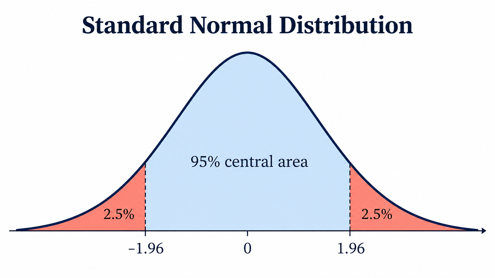
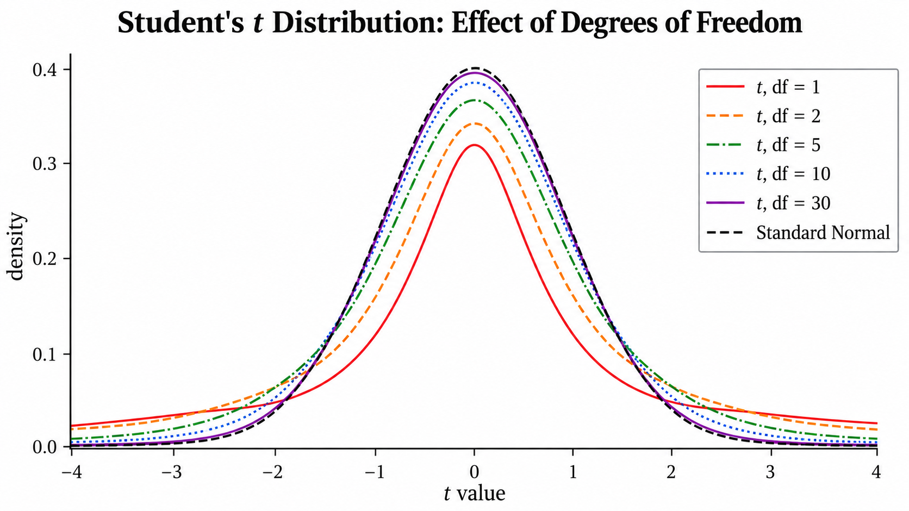

# Lesson 5: Confidence Intervals and One-Sample Tests — z and t
*ML / M04 — Statistics*

## The question

Lesson 4 developed the sample mean $\bar X$, sample standard deviation
$S$, and standard error. We now use them to quantify uncertainty about a
population mean $\mu$:

1. Given a confidence level, what range should estimate $\mu$?
2. Given a range width and an observation, what confidence level does that
   interval procedure have?
3. Given a confidence level and desired accuracy, how large should $n$ be?
4. Is a sample mean sufficiently far from a claimed value to be evidence
   against that claim?

We start with an i.i.d. Normal sample whose population standard deviation
$\sigma$ is known. We then handle the usual case where it is unknown.

## Learning goals

By the end of this lesson, you should be able to construct and interpret a
confidence interval for a mean; calculate a margin of error or sample size;
perform a two-sided one-sample test; and choose the appropriate $z$ or $t$
reference distribution.

## 1. The standard-Normal starting point

Let $Z\sim\mathcal N(0,1)$, and let $\Phi$ be its CDF. The two tails beyond
$\varepsilon$ have the same probability, so

$$
\begin{aligned}
P(|Z|>\varepsilon)
&=P(Z>\varepsilon)+P(Z<-\varepsilon)\\
&=2P(Z>\varepsilon)\\
&=2\bigl(1-\Phi(\varepsilon)\bigr).
\end{aligned}
$$

Therefore,

$$
P(|Z|\le\varepsilon)=2\Phi(\varepsilon)-1.
$$

For one observation $X\sim\mathcal N(\mu,\sigma^2)$, this says

$$
P\bigl(|X-\mu|>\varepsilon\sigma\bigr)
=2\bigl(1-\Phi(\varepsilon)\bigr).
$$

For inference about a mean, we normally have an i.i.d. sample
$X_1,\ldots,X_n$. If its population is Normal, then

$$
\bar X\sim\mathcal N\left(\mu,\frac{\sigma^2}{n}\right),
\qquad
\frac{\bar X-\mu}{\sigma/\sqrt n}\sim\mathcal N(0,1).
$$

Therefore the useful form is

$$
\begin{aligned}
P\left(\left|\frac{\bar X-\mu}{\sigma/\sqrt n}\right|>
\varepsilon\right)
&=P\left(\left|\bar X-\mu\right|>
\varepsilon\frac{\sigma}{\sqrt n}\right)\\
&=2\bigl(1-\Phi(\varepsilon)\bigr).
\end{aligned}
$$

The scale $\sigma/\sqrt n$, not $\sigma$, is the standard error of the
sample mean. For a non-Normal population, this Normal result is often an
approximation for a sufficiently large, well-behaved sample by the central
limit theorem.



For confidence $C=1-\alpha$, define

$$
z_{1-\alpha/2}=\Phi^{-1}(1-\alpha/2).
$$

Then $P(|Z|\le z_{1-\alpha/2})=C$. Common two-sided critical values are
$1.645$ (90%), $1.960$ (95%), and $2.576$ (99%).

## 2. Known $\sigma$: interval, confidence, and sample size

> **Learning note.** You do not need to memorize separate formulas for the
> margin of error $E$, sample size $n$, and confidence $C$. Start by
> standardizing $\bar X$ to $Z$, use the two-tail probability
> $P(|Z|>\varepsilon)=2\bigl(1-\Phi(\varepsilon)\bigr)$, and translate the
> resulting inequality back to the scale of $\bar X$. The formulas below are
> consequences of that logic chain.

Rearranging the central-Normal probability statement gives

$$
P\left(\bar X-z_{1-\alpha/2}\frac{\sigma}{\sqrt n}\le\mu\le
\bar X+z_{1-\alpha/2}\frac{\sigma}{\sqrt n}\right)=C.
$$

Thus, after observing $\bar x$, a $C$-level confidence interval is

$$
\boxed{\bar x\pm z_{1-\alpha/2}\frac{\sigma}{\sqrt n}.}
$$

Its **margin of error** (half-width) is

$$
\boxed{E=z_{1-\alpha/2}\frac{\sigma}{\sqrt n}.}
$$

**Example (Known standard deviation).** A Normal process has known
$\sigma=12$. A sample of $n=36$ has $\bar x=105$. Find a 95% interval
for $\mu$.

**Solution:**

Convert the sample mean to a standard-Normal random variable:

$$
Z=\frac{\bar X-\mu}{\sigma/\sqrt n}
=\frac{\bar X-\mu}{12/\sqrt{36}}
=\frac{\bar X-\mu}{2}.
$$

For a 95% central interval, the total probability in the two tails is
$1-0.95=0.05$. From
$P(|Z|>\varepsilon)=2\bigl(1-\Phi(\varepsilon)\bigr)$,

$$
\begin{aligned}
0.05=P(|Z|>\varepsilon)
&=P(Z>\varepsilon)+P(Z<-\varepsilon)\\
&=2P(Z>\varepsilon)\\
&=2\bigl(1-\Phi(\varepsilon)\bigr).
\end{aligned}
$$

Therefore,

$$
\Phi(\varepsilon)=0.975
\quad\Longrightarrow\quad
\varepsilon=z_{0.975}=1.96.
$$

Now substitute $Z=(\bar X-\mu)/2$ into the central probability and solve
the inequality for $\mu$:

$$
\begin{aligned}
P(-1.96\le Z\le1.96)&=0.95\\
P\left(-1.96\le\frac{\bar X-\mu}{2}\le1.96\right)&=0.95\\
P(-3.92\le\bar X-\mu\le3.92)&=0.95.
\end{aligned}
$$

After observing $\bar x=105$, solve the compound inequality:

$$
\begin{aligned}
-3.92&\le105-\mu\le3.92\\
-108.92&\le-\mu\le-101.08\\
101.08&\le\mu\le108.92.
\end{aligned}
$$

Thus the 95% confidence interval is $(101.08,\ 108.92)$.

The *procedure* used here contains the fixed true mean in 95% of repeated
samples of size 36.

$\square$

In frequentist inference, $\mu$ is fixed and the interval was random before
sampling. Once calculated, this particular interval either contains $\mu$ or
does not. Thus “95% confident” does not mean there is a 95% probability that
the fixed $\mu$ is in the observed interval.

### Given a width, find confidence

For the symmetric interval $[\bar x-w,\bar x+w]$, the confidence
coefficient is

$$
\boxed{C=2\Phi\left(\frac{w\sqrt n}{\sigma}\right)-1.}
$$

This is a property of the interval method, not a data-dependent probability
that an already-observed interval contains $\mu$.

**Example (Confidence supplied by an interval).** If $\sigma=12$ and $n=36$,
an observed sample mean is $\bar x=105$. What confidence level does the
interval $[101,\ 109]$ have?

Start by standardizing the sample mean:

$$
Z=\frac{\bar X-\mu}{\sigma/\sqrt n}
=\frac{\bar X-\mu}{12/\sqrt{36}}
=\frac{\bar X-\mu}{2}.
$$

The interval is centered at $105$, and its half-width is
$w=109-105=4$. It contains $\mu$ precisely when $|\bar X-\mu|\le4$.
In terms of $Z$, this is

$$
|Z|=\left|\frac{\bar X-\mu}{2}\right|\le\frac{4}{2}=2.
$$

Use the tail formula to find the probability of this central event:

$$
\begin{aligned}
C&=P(|Z|\le2)\\
&=1-P(|Z|>2)\\
&=1-2\bigl(1-\Phi(2)\bigr)\\
&=2\Phi(2)-1\\
&\approx0.9545.
\end{aligned}
$$

So the procedure has about 95.45% confidence.

$\square$

### Given confidence and width, find sample size

To make the margin of error at most $E$, solve the formula above for $n$:

$$
\boxed{n\ge\left(\frac{z_{1-\alpha/2}\sigma}{E}\right)^2.}
$$

**Example (Sample size for a target width).** A Normal process has known
$\sigma=12$. How many independent observations are needed for a 95%
confidence interval whose margin of error is at most $E=2$?

**Solution:**

Start by standardizing the sample mean:

$$
Z=\frac{\bar X-\mu}{\sigma/\sqrt n}
=\frac{\bar X-\mu}{12/\sqrt n}.
$$

For 95% confidence, the total probability in the two tails is
$1-0.95=0.05$. Using the tail formula,

$$
\begin{aligned}
0.05=P(|Z|>\varepsilon)
&=P(Z>\varepsilon)+P(Z<-\varepsilon)\\
&=2P(Z>\varepsilon)\\
&=2\bigl(1-\Phi(\varepsilon)\bigr).
\end{aligned}
$$

Therefore,

$$
\Phi(\varepsilon)=0.975
\quad\Longrightarrow\quad
\varepsilon=z_{0.975}=1.96.
$$

Thus the 95% central probability statement is

$$
P\left(
\left|\frac{\bar X-\mu}{12/\sqrt n}\right|\le1.96
\right)=0.95.
$$

Equivalently, the margin of error is

$$
E=1.96\frac{12}{\sqrt n}.
$$

Require this margin to be at most 2 and solve the resulting inequality:

$$
\begin{aligned}
1.96\frac{12}{\sqrt n}&\le2\\
\sqrt n&\ge\frac{1.96(12)}{2}\\
n&\ge\left(\frac{1.96(12)}{2}\right)^2\\
n&\ge138.2976.
\end{aligned}
$$

Because a sample size must be a whole number and the margin of error must not
exceed 2, round **up**. We need $n=139$ independent observations.

$\square$

## 3. From a confidence interval to a hypothesis test

For a two-sided test with known $\sigma$, begin by assuming the null
hypothesis is true:

$$
H_0:\mu=\mu_0,
\qquad H_A:\mu\ne\mu_0.
$$

Under $H_0$, convert the sample mean to a standard-Normal random variable:

$$
Z=\frac{\bar X-\mu_0}{\sigma/\sqrt n}\sim\mathcal N(0,1).
$$

After observing the sample mean $\bar x$, this random variable has the
observed value

$$
z_{\mathrm{obs}}=\frac{\bar x-\mu_0}{\sigma/\sqrt n}.
$$

At significance level $\alpha$, reserve total probability $\alpha$ for the
two extreme tails of the $Z$ distribution. Each tail has probability
$\alpha/2$, so the cutoff is $z_{1-\alpha/2}$. If the observed value falls
in either tiny tail, then an outcome at least that far from $\mu_0$ would be
unlikely **if $H_0$ were true**. We then reject $H_0$:

$$
|z_{\mathrm{obs}}|>z_{1-\alpha/2}.
$$

The two-sided p-value measures the probability, assuming $H_0$, of seeing a
result at least as extreme as the observed one:

$$
\boxed{p=2\bigl(1-\Phi(|z_{\mathrm{obs}}|)\bigr).}
$$

The p-value is not the probability that $H_0$ is false. If $p>\alpha$, we
fail to reject $H_0$; we have not proved it true.

**Example (Two-sided z-test).** With $\sigma=12$, $n=36$, and
$\bar x=105$, test $H_0:\mu=100$ at $\alpha=0.05$.

**Solution:**

$$
z=\frac{105-100}{12/\sqrt{36}}=2.5,
\qquad p=2(1-\Phi(2.5))\approx0.0124.
$$

Since $2.5>1.96$, reject $H_0$. The 95% interval above also excludes
100, which is equivalent to rejecting this two-sided 5% test.

$\square$

## 4. Unknown $\sigma$: Student's $t$

The true population standard deviation is rarely supplied. Estimate it by

$$
S=\sqrt{\frac1{n-1}\sum_{i=1}^n(X_i-\bar X)^2}.
$$

For an i.i.d. Normal sample, replacing $\sigma$ with random $S$ changes
the reference distribution:

$$
\boxed{T=\frac{\bar X-\mu}{S/\sqrt n}\sim t_{n-1}.}
$$

The numerator must be the sample mean $\bar X$, and the denominator must
be its estimated standard error $S/\sqrt n$. Thus
$(X-\mu)/S$ is not the one-sample t statistic for a population mean.

Student's $t$ is symmetric and bell-shaped like the standard Normal but has
heavier tails, reflecting uncertainty in the estimated standard deviation. As
the degrees of freedom increase, it approaches the standard Normal.



We need not use the $t$ density formula. Software supplies its critical
values and CDF. For a $C=1-\alpha$ interval, use

$$
\boxed{\bar x\pm t_{n-1,\,1-\alpha/2}\frac{s}{\sqrt n}.}
$$

For the two-sided test $H_0:\mu=\mu_0$, use

$$
t=\frac{\bar x-\mu_0}{s/\sqrt n}
$$

and obtain the p-value from the $t_{n-1}$ CDF. The testing framework is
unchanged; only the reference distribution changes.

**Example (t interval and test).** A random sample of $n=16$ model errors
has $\bar x=5.2$ and $s=8.0$. Find a 95% interval and test
$H_0:\mu=0$.

**Solution:**

There are 15 degrees of freedom, $t_{15,0.975}\approx2.131$, and
$s/\sqrt n=2$. Therefore,

$$
5.2\pm2.131(2)=(0.938,\ 9.462),
\qquad t=\frac{5.2}{2}=2.6.
$$

Because $2.6>2.131$, reject $H_0$ at 5%. The two-sided p-value is about
$0.020$, and the interval likewise excludes 0.

$\square$

## 5. Computing with SciPy

The mathematics above supplies the standardization, interval, and test
formulas. In SciPy, the only new tools you need are:

- `ppf(q)`: the inverse CDF (quantile). It returns the value whose CDF is
  `q`, so use it to obtain a critical value.
- `cdf(x)`: the CDF. It returns the probability to the left of `x`, so use it
  to calculate tail probabilities and p-values.

```python
from scipy.stats import norm, t

alpha = 0.05

# Standard Normal distribution: Z ~ N(0, 1)
z_critical = norm.ppf(1 - alpha / 2)  # z_0.975 = 1.96
norm.cdf(1.96)                         # P(Z <= 1.96) = 0.975

# Student's t distribution, with df degrees of freedom
df = 15
t_critical = t.ppf(1 - alpha / 2, df=df)  # t_(15, 0.975)
t.cdf(t_critical, df=df)                  # P(T <= t_critical) = 0.975

# Once you calculate a test statistic from the formulas above,
# its two-sided p-value is twice its left-tail probability.
z_obs = 2.5
z_p_value = 2 * norm.cdf(-abs(z_obs))

t_obs = 2.6
t_p_value = 2 * t.cdf(-abs(t_obs), df=df)
```

## Check your understanding

1. With known $\sigma=10$, $n=25$, and $\bar x=52$, find a 90%
   interval for $\mu$.
2. With the same $\sigma$ and $n$, what confidence level corresponds to
   $\bar x\pm3$?
3. How large must $n$ be when $\sigma=10$ to obtain a 99% interval with
   margin of error at most 2?
4. A 95% t interval is $(14.1,19.7)$. What is the conclusion of tests of
   $H_0:\mu=16$ and $H_0:\mu=20$, both at 5%?

## Takeaway

With known $\sigma$, standardize a sample mean using $\sigma/\sqrt n$
and use the Normal CDF. With unknown $\sigma$, standardize using
$S/\sqrt n$ and use Student's $t$ distribution with $n-1$ degrees of
freedom. Confidence intervals and tests use the same framework; estimating
the standard error is what changes the reference distribution.
